<section class="cover">
  <div class="brand-band"></div>
  
  <div class="cover-rule"></div>
  <h1>Software Engineering Group Project — Final Report</h1>
  <p class="assignment">Group project - Final report</p>
  <p class="tagline">Living the campus, Living the youth, Living life</p>
  <dl class="cover-meta">
    <dt>Target Campus</dt><dd>Tongji University, Jiading Campus</dd>
    <dt>Product Type</dt><dd>Mobile Application</dd>
    <dt>Team Members</dt><dd>Francesco Nativitati, Jacopo Donati, Matteo Silvetro, YiMing</dd>
  </dl>
</section>

# Table of Contents

<nav class="toc">
  <ol>
    <li><a href="#1-project-overview-and-report-structure">Project Overview and Report Structure</a>
      <ol>
        <li><a href="#11-product-summary">Product Summary</a></li>
        <li><a href="#12-report-structure">Report Structure</a></li>
        <li><a href="#13-source-basis-and-affine-availability">Source Basis and Affine Availability</a></li>
      </ol>
    </li>
    <li><a href="#2-project-context-and-vision">Project Context and Vision</a>
      <ol>
        <li><a href="#21-campus-problem">Campus Problem</a></li>
        <li><a href="#22-target-users-and-trust-boundary">Target Users and Trust Boundary</a></li>
        <li><a href="#23-product-positioning">Product Positioning</a></li>
      </ol>
    </li>
    <li><a href="#3-requirements-and-scope">Requirements and Scope</a>
      <ol>
        <li><a href="#31-methodology">Methodology</a></li>
        <li><a href="#32-user-story-collection">User Story Collection</a></li>
        <li><a href="#33-mvp-and-post-mvp-boundary">MVP and Post-MVP Boundary</a></li>
        <li><a href="#34-functional-requirements">Functional Requirements</a></li>
        <li><a href="#35-non-functional-requirements">Non-Functional Requirements</a></li>
        <li><a href="#36-traceability-and-priority-logic">Traceability and Priority Logic</a></li>
      </ol>
    </li>
    <li><a href="#4-requirement-analysis">Requirement Analysis</a>
      <ol>
        <li><a href="#41-use-case-model">Use Case Model</a></li>
        <li><a href="#42-use-case-narratives-and-priority-matrix">Use Case Narratives and Priority Matrix</a></li>
        <li><a href="#43-data-flow-analysis">Data Flow Analysis</a></li>
        <li><a href="#44-data-stores-and-crud-validation">Data Stores and CRUD Validation</a></li>
        <li><a href="#45-entity-relationship-model">Entity Relationship Model</a></li>
      </ol>
    </li>
    <li><a href="#5-on-screen-appearance-and-ui-requirements">On-Screen Appearance and UI Requirements</a>
      <ol>
        <li><a href="#51-methodology">Methodology</a></li>
        <li><a href="#52-screen-inventory">Screen Inventory</a></li>
        <li><a href="#53-global-ui-constraints">Global UI Constraints</a></li>
        <li><a href="#54-visual-identity">Visual Identity</a></li>
      </ol>
    </li>
    <li><a href="#6-architecture-and-object-oriented-design">Architecture and Object-Oriented Design</a>
      <ol>
        <li><a href="#61-architectural-choice">Architectural Choice</a></li>
        <li><a href="#62-module-responsibilities">Module Responsibilities</a></li>
        <li><a href="#63-stores-and-ownership-rules">Stores and Ownership Rules</a></li>
        <li><a href="#64-object-model">Object Model</a></li>
        <li><a href="#65-interaction-diagrams">Interaction Diagrams</a></li>
        <li><a href="#66-lifecycle-and-activity-diagrams">Lifecycle and Activity Diagrams</a></li>
        <li><a href="#67-component-model">Component Model</a></li>
      </ol>
    </li>
    <li><a href="#7-implementation-and-development-artifacts">Implementation and Development Artifacts</a>
      <ol>
        <li><a href="#71-private-repository-access">Private Repository Access</a></li>
        <li><a href="#72-monorepo-organization">Monorepo Organization</a></li>
        <li><a href="#73-backend-implementation">Backend Implementation</a></li>
        <li><a href="#74-mobile-implementation">Mobile Implementation</a></li>
        <li><a href="#75-current-implementation-status">Current Implementation Status</a></li>
      </ol>
    </li>
    <li><a href="#8-testing-and-quality-assurance">Testing and Quality Assurance</a>
      <ol>
        <li><a href="#81-ci-workflow">CI Workflow</a></li>
        <li><a href="#82-local-verification">Local Verification</a></li>
        <li><a href="#83-regression-scope">Regression Scope</a></li>
        <li><a href="#84-qa-limitations">QA Limitations</a></li>
      </ol>
    </li>
    <li><a href="#9-user-documentation-and-user-manual">User Documentation and User Manual</a>
      <ol>
        <li><a href="#91-student-user-manual">Student User Manual</a></li>
        <li><a href="#92-campus-admin-user-manual">Campus Admin User Manual</a></li>
        <li><a href="#93-common-errors-and-troubleshooting">Common Errors and Troubleshooting</a></li>
      </ol>
    </li>
    <li><a href="#10-project-management-and-time-management">Project Management and Time Management</a>
      <ol>
        <li><a href="#101-work-breakdown-structure">Work Breakdown Structure</a></li>
        <li><a href="#102-critical-path-and-slack">Critical Path and Slack</a></li>
        <li><a href="#103-cost-benefit-estimate">Cost-Benefit Estimate</a></li>
      </ol>
    </li>
    <li><a href="#11-limitations-and-future-work">Limitations and Future Work</a>
      <ol>
        <li><a href="#111-course-mvp-completion">Course MVP Completion</a></li>
        <li><a href="#112-alpha-and-demo-limitations">Alpha and Demo Limitations</a></li>
        <li><a href="#113-future-roadmap">Future Roadmap</a></li>
      </ol>
    </li>
    <li><a href="#12-conclusion">Conclusion</a></li>
    <li><a href="#appendices">Appendices</a>
      <ol>
        <li><a href="#appendix-a---full-user-story-table">Appendix A - Full User Story Table</a></li>
        <li><a href="#appendix-b---full-functional-requirements">Appendix B - Full Functional Requirements</a></li>
        <li><a href="#appendix-c---full-non-functional-requirements">Appendix C - Full Non-Functional Requirements</a></li>
        <li><a href="#appendix-d---full-use-case-table-and-priority-matrix">Appendix D - Full Use Case Table and Priority Matrix</a></li>
        <li><a href="#appendix-e---full-crud-matrix">Appendix E - Full CRUD Matrix</a></li>
        <li><a href="#appendix-f---full-entity-and-attribute-catalog">Appendix F - Full Entity and Attribute Catalog</a></li>
        <li><a href="#appendix-g---full-relationship-and-data-store-tables">Appendix G - Full Relationship and Data Store Tables</a></li>
        <li><a href="#appendix-h---original-diagrams-gallery">Appendix H - Original Diagrams Gallery</a></li>
        <li><a href="#appendix-i---github-actions-and-test-evidence">Appendix I - GitHub Actions and Test Evidence</a></li>
        <li><a href="#appendix-j---technical-reproducibility-notes">Appendix J - Technical Reproducibility Notes</a></li>
        <li><a href="#appendix-k---documentation-sources-used">Appendix K - Documentation Sources Used</a></li>
        <li><a href="#appendix-l---glossary">Appendix L - Glossary</a></li>
      </ol>
    </li>
  </ol>
</nav>

# 1. Project Overview and Report Structure

## 1.1 Product Summary

InCampus is a campus-scoped mobile application for verified university students who want to turn ordinary free time into shared campus activity. The first target setting is Tongji University, Jiading Campus. The product focuses on practical coordination: a student creates an activity with a time, place, category, capacity, and participation mode; other verified students discover it inside the campus boundary; participation is handled through direct join or host approval; the system records notifications, reports, blocks, and consent-sensitive administrative insight rules.

The final course deliverable consolidates requirements engineering, requirement analysis, object-oriented design, implementation evidence, testing evidence, user documentation, project-management artifacts, and limitations. It is intentionally broader than an executive digest. Full tables are preserved in appendices and original diagrams are reproduced as full-page figures when readability requires it.

## 1.2 Report Structure

The report follows the logical order of the project work. Sections 2 to 5 recover the requirements and analysis phase. Section 6 presents the architectural and object-oriented design. Section 7 documents the private implementation artifacts without exposing source-code dumps. Section 8 records the verified automated QA evidence. Section 9 provides user-facing documentation. Sections 10 to 12 close with project-management analysis, limitations, future work, and synthesis. Appendices A to L preserve the full source tables, diagram gallery, evidence excerpts, reproducibility notes, sources, and glossary.

## 1.3 Source Basis and Affine Availability

The report was rebuilt from four source groups: previous course reports, current repository documentation, implementation/CI evidence, and Affine-exported project workspace material. The exported Affine material under `Documentation/INcampusFILES/` is treated as the primary project artifact source because it contains the full user-story table, functional and non-functional requirements, use case table, CRUD matrix, entity catalog, relationship table, architecture documents, and original scenario diagrams.

Live Affine MCP access was explicitly checked during this rebuild. The available tool/resource discovery surfaces exposed Adobe Acrobat, Notion, and GitHub helpers, but no Affine MCP namespace or resource server was mounted in this session; `list_mcp_resources` returned no resources. Therefore, no artifact is silently invented as an Affine replacement. Where a standalone original was not available through the mounted tools, the report uses either the local Affine export or the original embedded media recovered from the previous DOCX reports, and identifies that source in Appendix K.

# 2. Project Context and Vision

## 2.1 Campus Problem

University campuses create proximity, but proximity alone does not create interaction. Students may share cafeterias, libraries, sport courts, dormitory areas, and study spaces while still missing simple chances to meet for ordinary activities. This is especially visible for newcomers and international students, who may not yet have stable social circles or may hesitate to approach unfamiliar peers without context.

The requirements report framed the problem as both logistical and trust-related. Students want a practical way to find others for meals, study sessions, sport, language exchange, walks, or informal campus events. At the same time, they need assurance that participants belong to the university context, that interaction remains bounded by campus scope, and that safety tools exist if a situation becomes uncomfortable.

## 2.2 Target Users and Trust Boundary

The main user group is Tongji University, Jiading Campus students, including local and international students. The main administrative actor is a controlled campus administrator responsible for campus configuration, structured options, report review, and consent-based insight access. The trust boundary is created by university email verification, campus selection, student profile setup, report/block mechanisms, and scoped administrative authorization.

This boundary is essential to the product identity. InCampus is not a public follower-based platform and not an open-ended profile browsing product. The primary object is the campus activity, not the profile. Profiles are context-limited and expose only the minimum public information needed for trust in an activity workflow.

## 2.3 Product Positioning

| Dimension | InCampus Position |
| --- | --- |
| Product type | Verified campus activity coordination mobile app. |
| First deployment context | Tongji University, Jiading Campus. |
| Core loop | Create activity, browse/filter, view details, join/request, manage requests, notify, report/block when needed. |
| Trust model | University identity rule, campus scope, moderation, blocking, community rules, and privacy consent. |
| MVP style | Lightweight, activity-first, student-centered, campus-specific. |
| Excluded pattern | Generic public social feed or unrestricted profile discovery. |

# 3. Requirements and Scope

## 3.1 Methodology

The requirements workflow began with user stories and moved through functional requirements, non-functional requirements, use case derivation, use case priority scoring, data-flow analysis, CRUD validation, entity modeling, relationship modeling, and UI requirements. Each step was traceable to the previous one. The exported Affine files show this chain explicitly through user-story IDs, FR/NFR codes, use case IDs, data store IDs, and version logs.

## 3.2 User Story Collection

The final exported user-story catalog contains 30 stories across students, student hosts, student guests, and campus admins. Stories cover identity, campus selection, profile setup/editing, activity creation, feed browsing, filtering, activity details, participation, notifications, safety, campus configuration, structured options, and consent-based insights. Post-MVP stories preserve broader social ideas without letting them dilute the MVP.

| Scope | User Stories | Product Meaning |
| --- | --- | --- |
| MVP | US-01 to US-07, US-09, US-11, US-14 to US-30 where marked MVP | Verified access, campus coordination, activity lifecycle, participation, safety, admin setup, consent. |
| Post-MVP | US-08, US-10, US-12, US-13 | Direct messages, friend indicators, participation points, shared activity photos. |

The complete original table is preserved in Appendix A.

## 3.3 MVP and Post-MVP Boundary

The MVP boundary is intentionally activity-first. It includes enough identity, profile, discovery, participation, notification, safety, and campus-administration functionality for a coherent course implementation. Broader social and reward features remain Post-MVP so that the first implementation can preserve privacy, safety, and traceability.

| MVP Area | Included Capability |
| --- | --- |
| Access and profile | Sign up, verify email, sign in, select campus, create/edit profile, update consent. |
| Activity lifecycle | Create activity, set date/time/location/category/capacity, update status, cancel/delete where authorized. |
| Discovery and participation | Browse/filter feed, view details, direct join, request to join, withdraw pending request, leave joined activity, personal activity list. |
| Host controls | View pending requests, approve/decline requests, preserve capacity constraints. |
| Notifications | Host, participant, cancellation, reminder event handling, notification list, context opening. |
| Safety | Report, review report, block user, community rules, moderation delegation. |
| Campus admin | Configure campus, manage structured options, review reports, view consent-based student insights. |

## 3.4 Functional Requirements

The functional requirement catalog defines the system behavior needed to realize the MVP. The final exported table includes the updated consent, structured option, withdraw/leave, cancellation, and insight requirements. Appendix B preserves the full table.

| Group | Examples | Implementation Mapping |
| --- | --- | --- |
| Access and identity | FR-101 to FR-105, FR-1501, FR-1601 | Auth routes, identity rule validation, verification, sign-in, campus selection. |
| Profile and consent | FR-1401 to FR-1403, FR-2901 to FR-2903 | Profile routes and mobile screens, granular campus-insight consent. |
| Activity lifecycle | FR-301 to FR-305, FR-2501, FR-2601 to FR-2603 | Activity creation, scheduling, lifecycle state, hard delete/cancel flows. |
| Discovery and participation | FR-401 to FR-406, FR-2001 to FR-2002, FR-2701 to FR-2704 | Feed/detail routes, join/request, withdraw, leave, personal list. |
| Notifications | FR-601 to FR-704, FR-1101, FR-2801 to FR-2804 | Notification handlers, records, list/context routes, cancellation/reminder support. |
| Safety and moderation | FR-201 to FR-203, FR-1701 to FR-1901 | Report submission/review, block creation, community rules. |
| Campus administration | FR-2301 to FR-2302, FR-3001 | Campus creation, options management, consent-based insights. |

## 3.5 Non-Functional Requirements

The NFR catalog covers security, usability, performance, reliability, scalability, traceability, and privacy. The implementation and design give particular weight to campus isolation, consent, safe moderation routing, transactionality, and minimal profile exposure. Appendix C preserves the full original table.

| Theme | Representative Concern | Design Response |
| --- | --- | --- |
| Security | Verified student scope, credential protection, minimal exposure. | University email validation, auth middleware, account/profile separation, contextual profile reads. |
| Reliability | Participation consistency, report traceability, block enforcement. | Transactional participation updates, report status model, reciprocal block checks in supported flows. |
| Usability | Onboarding, activity details, request flows, report clarity. | Short screen flows, scannable activity cards, structured options, clear moderation actions. |
| Performance | Feed filtering, notification delivery, status changes. | Scoped reads, internal event handling, lightweight notification records. |
| Scalability | Multi-campus setup without new code per campus. | CampusID tenant boundary and campus-specific structured options. |
| Privacy | Student control over non-academic campus-life insights. | Consent stored in AP account state and checked before admin insight assembly. |

## 3.6 Traceability and Priority Logic

Traceability connects user stories, FRs, NFRs, and use cases. The use case priority matrix then scores business/user value, architectural importance, risk, and MVP relevance. High-priority flows are the ones needed to prove the product loop: verified onboarding, campus selection, activity creation, discovery, joining/requesting, host decisions, notifications, safety, configuration, and consent-based insights.

# 4. Requirement Analysis

## 4.1 Use Case Model

The use case diagram was exported from the Affine project documentation and updated to v1.7 for final pre-skeleton alignment. It shows the four main actors and the MVP use case package.

<div class="figure-page landscape">
<figure>
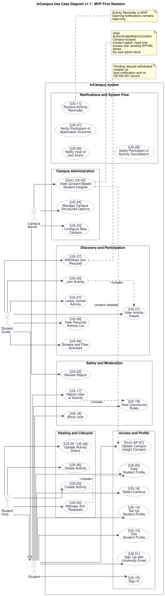
<figcaption>Figure 4.1: Original Affine-exported use case diagram v1.7.</figcaption>
</figure>
</div>

## 4.2 Use Case Narratives and Priority Matrix

Use cases were derived from user stories and scored using the project priority matrix. Appendix D preserves the full use case table and priority rows. The representative Join Activity narrative is central because it combines participation mode branching, block checks, capacity checks, duplicate prevention, and notification events.

| Representative Use Case | Main Actor | Why It Matters |
| --- | --- | --- |
| Sign Up with University Email | Student | Establishes verified identity and university boundary. |
| Select Campus | Student | Creates the tenant scope for all later activity reads/writes. |
| Create Activity | Student Host | Produces the main discoverable object in the product. |
| Join Activity | Student Guest | Completes the core product loop. |
| Manage Join Requests | Student Host | Supports controlled participation and safety. |
| Configure New Campus | Campus Admin | Enables multi-campus operation by configuration. |
| View Consent-Based Student Insights | Campus Admin | Demonstrates privacy-by-design administrative access. |

## 4.3 Data Flow Analysis

The DFD work followed a subsystem-first method. Each subgroup produced a workdoc and diagram before the system-level merge. The previous requirements report includes the original embedded DFD evidence recovered from the DOCX media package. The full standalone DFD source was not exposed as a mounted Affine MCP resource in this session; therefore the report uses the original recovered report images and documents that limitation in Appendix K.

<div class="figure-page landscape">
<figure>
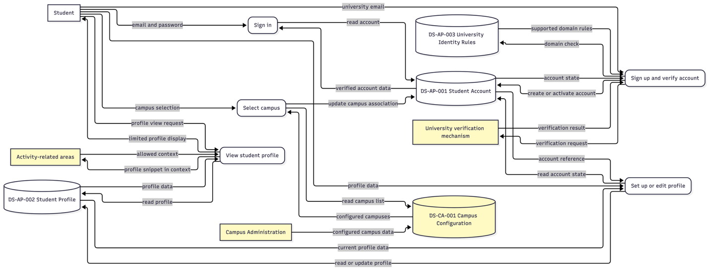
<figcaption>Figure 4.2: Original requirements-report subgroup DFD example recovered from the DOCX media package.</figcaption>
</figure>
</div>

<div class="figure-page landscape">
<figure>
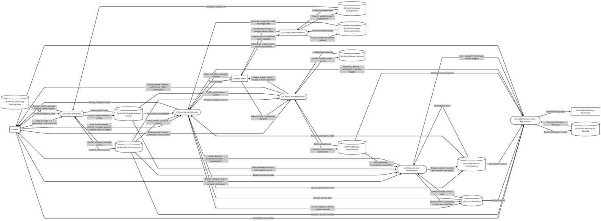
<figcaption>Figure 4.3: Original requirements-report final merged DFD recovered from the DOCX media package.</figcaption>
</figure>
</div>

## 4.4 Data Stores and CRUD Validation

The final CRUD matrix defines operations over ten canonical logical stores. It validates that each module writes its owned stores and that cross-module effects are handled through allowed reads, events, or owner-native commands. Appendix E preserves the full CRUD matrix.

| Store | Name | Owning Module |
| --- | --- | --- |
| DS-CA-001 | Campus Configuration | Campus Administration |
| DS-CA-002 | Campus Structured Options | Campus Administration |
| DS-AP-001 | Student Account | Access and Profile |
| DS-AP-002 | Student Profile | Access and Profile |
| DS-AP-003 | University Identity Rules | Access and Profile |
| DS-HL-001 | Activities | Hosting and Lifecycle |
| DS-HL-002 | Activity Participations | Hosting and Lifecycle |
| DS-SM-001 | Block Relationships | Safety and Moderation |
| DS-SM-002 | Report Records | Safety and Moderation |
| DS-NS-001 | Notification Records | Notifications and System Flow |

## 4.5 Entity Relationship Model

The ERD was produced from the DFD, CRUD matrix, entity catalog, and relationship table. Appendix F and Appendix G preserve the full entity and relationship documentation.

<div class="figure-page landscape">
<figure>
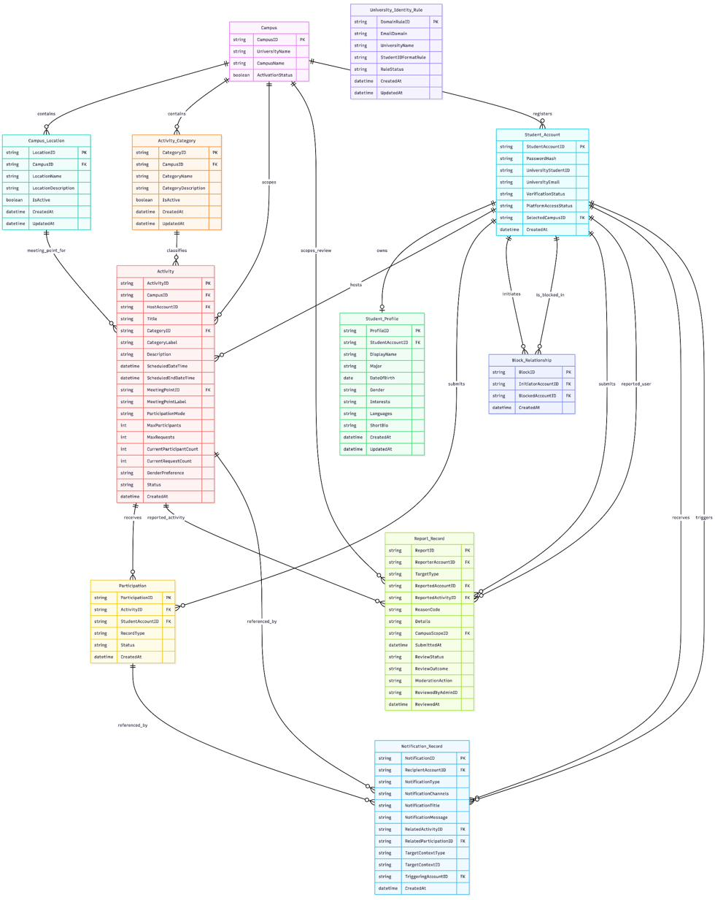
<figcaption>Figure 4.4: Original requirements-report Entity Relationship Diagram recovered from the DOCX media package.</figcaption>
</figure>
</div>

# 5. On-Screen Appearance and UI Requirements

## 5.1 Methodology

The on-screen appearance requirements were derived from MVP use cases, FR/NFR constraints, entity fields, safety rules, and DFD ownership boundaries. The earlier requirements report describes a two-pass process: first mapping use cases to screens and required actions, then reviewing the result for MVP alignment, missing fields, permission states, block enforcement, unsupported behavior, and traceability issues.

## 5.2 Screen Inventory

The implemented mobile application and UI brief confirm the following MVP screen inventory.

| Screen Area | Student/Admin Screen |
| --- | --- |
| Access | Sign In, Sign Up, Campus Selection |
| Profile | Profile Setup, Mine/Profile, Consent Settings, Student Profile context |
| Activities | Activity Feed, Activity Details, Create Activity, Manage Requests, Personal Activity List |
| Notifications | Notification List, Notification Fallback/Context |
| Safety | Report Submission, Block User, Community Rules |
| Campus Admin demo | Admin Dashboard, Structured Options, Reports, Report Detail, Admin Insights |

## 5.3 Global UI Constraints

The UI requirements emphasize clarity, trust, and low-friction participation. Student screens must keep activity details scannable, make participation status visible, show errors without ambiguity, and respect block/report constraints. Admin screens must make campus scope explicit and avoid suggesting unrestricted student surveillance.

| Constraint | Requirement |
| --- | --- |
| Campus scope | Activity and admin views must make campus context visible or implicit through scoped navigation. |
| Minimal profile exposure | Profiles appear in relevant contexts only and avoid unnecessary personal data. |
| Consent clarity | Insight sharing must be understandable and revocable without affecting ordinary app access. |
| Safety access | Report, block, and community-rules flows must be discoverable from relevant contexts. |
| Empty/error states | Screens must provide clear empty states, validation errors, and unavailable-target fallbacks. |

## 5.4 Visual Identity

The final report and product UI use the InCampus identity: primary navy, deep navy, campus green, light app background, and white/card surfaces. Coral/yellow accents are used sparingly. This identity supports the product vision because it reads as campus-oriented and trustworthy rather than as a generic public social product.

# 6. Architecture and Object-Oriented Design

## 6.1 Architectural Choice

The Object-Oriented Design Report defines the backend architecture as a Multi-Tenant Modular Monolith with Event-Driven Internal Flows. This choice keeps deployment and testing simple while enforcing module boundaries through ownership rules, event contracts, command delegation, and scoped persistence.

<div class="figure-page landscape">
<figure>
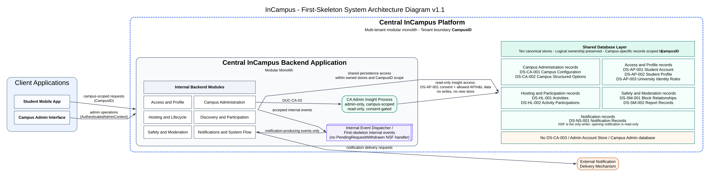
<figcaption>Figure 6.1: Original Affine-exported system architecture diagram v1.1.</figcaption>
</figure>
</div>

## 6.2 Module Responsibilities

| Module | Responsibility |
| --- | --- |
| Access and Profile | University identity, account activation, campus selection, student profile, consent, platform access status. |
| Campus Administration | Campus configuration, structured options, campus-admin context, consent-based insights. |
| Hosting and Lifecycle | Activity truth, participation truth, capacity, lifecycle status, host request decisions. |
| Discovery and Participation | Feed assembly, filtering, activity details, join/request/withdraw/leave orchestration. |
| Safety and Moderation | Blocks, report submission, report review, moderation outcomes, community rules. |
| Notifications and System Flow | Event handlers, notification records, context opening, suppression/fallback logic. |

## 6.3 Stores and Ownership Rules

The architecture uses a shared relational database but preserves logical ownership. Modules may read other stores only for justified context. They may not mutate another module's truth directly. Notification consequences are event-driven. Moderation consequences are delegated through internal commands to the owning module.

## 6.4 Object Model

The design class diagram translates the ten stores into implementation-aware entities. StudentAccount is the identity root; Campus is the tenant boundary; Activity and Participation carry lifecycle and capacity state; BlockRelationship, ReportRecord, and NotificationRecord implement safety and system flow.

<div class="figure-page landscape">
<figure>
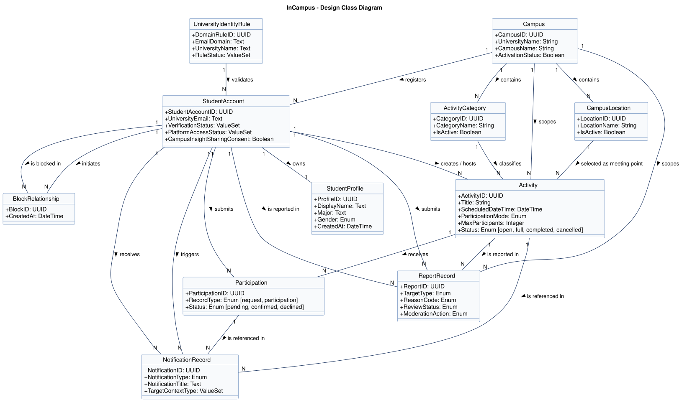
<figcaption>Figure 6.2: Original design class diagram recovered from the Object-Oriented Design Report DOCX media.</figcaption>
</figure>
</div>

## 6.5 Interaction Diagrams

The design includes system sequence diagrams, detailed sequence diagrams, and collaboration diagrams. These diagrams show how the MVP flows respect tenant scope, ownership, transactionality, event handling, and consent.

<div class="figure-page landscape">
<figure>
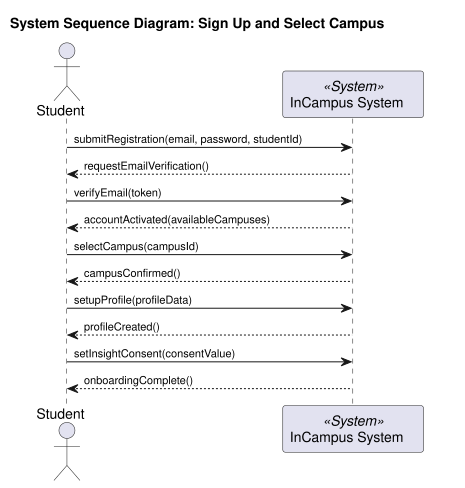
<figcaption>Figure 6.3: Original system sequence diagram - Sign Up and Select Campus.</figcaption>
</figure>
</div>

<div class="figure-page landscape">
<figure>
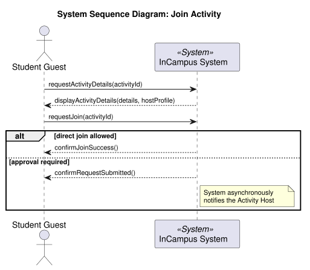
<figcaption>Figure 6.4: Original system sequence diagram - Join Activity.</figcaption>
</figure>
</div>

<div class="figure-page landscape">
<figure>

<figcaption>Figure 6.5: Original sequence diagram - Sign Up and Select Campus.</figcaption>
</figure>
</div>

<div class="figure-page landscape">
<figure>

<figcaption>Figure 6.6: Original sequence diagram - Join Activity.</figcaption>
</figure>
</div>

<div class="figure-page landscape">
<figure>

<figcaption>Figure 6.7: Original sequence diagram - Manage Join Requests.</figcaption>
</figure>
</div>

<div class="figure-page landscape">
<figure>
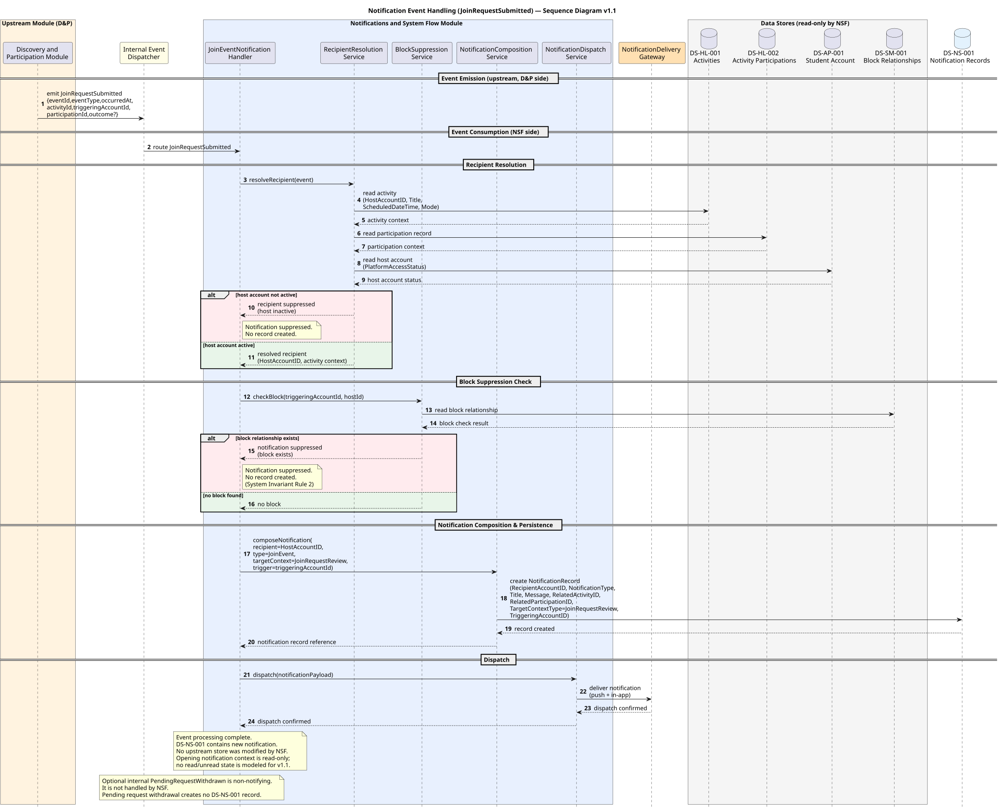
<figcaption>Figure 6.8: Original sequence diagram - Notification Event Handling.</figcaption>
</figure>
</div>

<div class="figure-page landscape">
<figure>
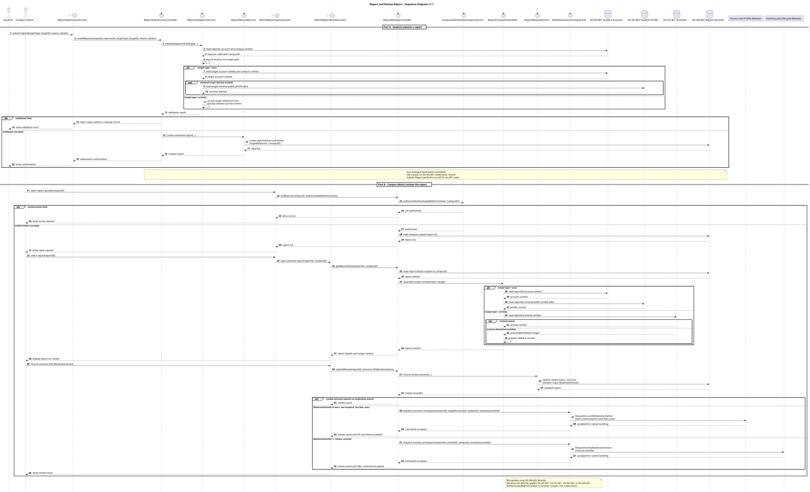
<figcaption>Figure 6.9: Original sequence diagram - Report and Review Report.</figcaption>
</figure>
</div>

<div class="figure-page landscape">
<figure>

<figcaption>Figure 6.10: Original sequence diagram - Configure New Campus.</figcaption>
</figure>
</div>

<div class="figure-page landscape">
<figure>

<figcaption>Figure 6.11: Original sequence diagram - View Consent-Based Student Insights.</figcaption>
</figure>
</div>

<div class="figure-page landscape">
<figure>
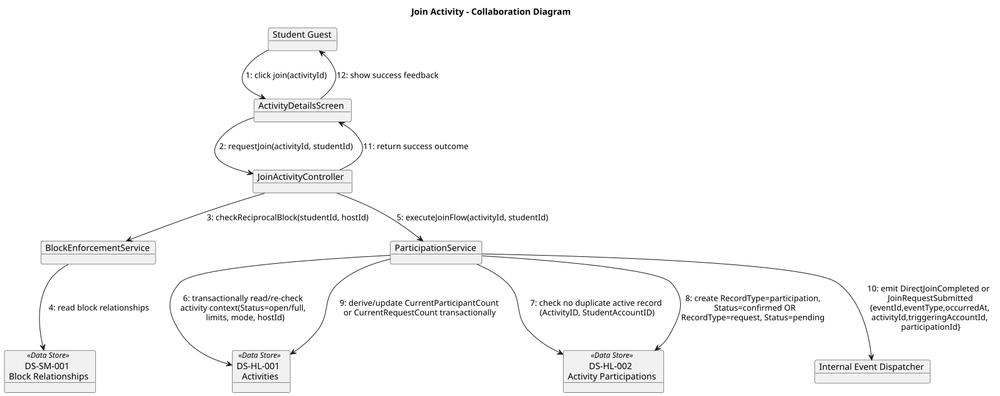
<figcaption>Figure 6.12: Original collaboration diagram - Join Activity.</figcaption>
</figure>
</div>

<div class="figure-page landscape">
<figure>
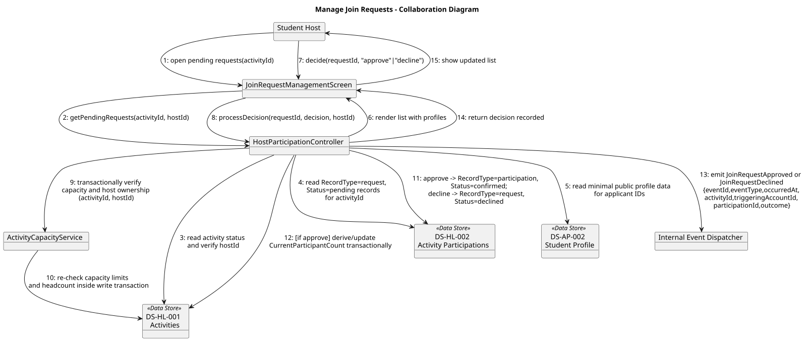
<figcaption>Figure 6.13: Original collaboration diagram - Manage Join Requests.</figcaption>
</figure>
</div>

<div class="figure-page landscape">
<figure>
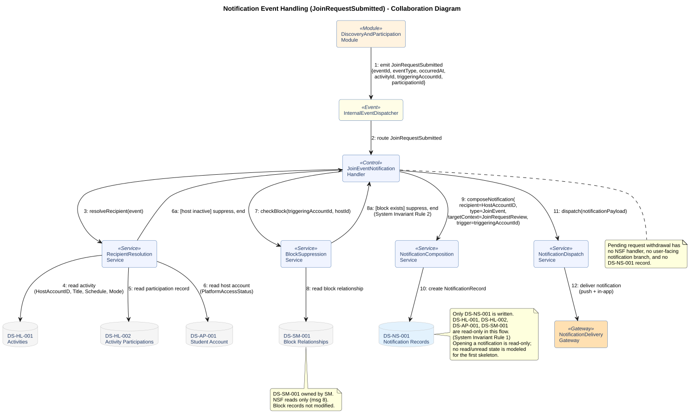
<figcaption>Figure 6.14: Original collaboration diagram - Notification Event Handling.</figcaption>
</figure>
</div>

<div class="figure-page landscape">
<figure>
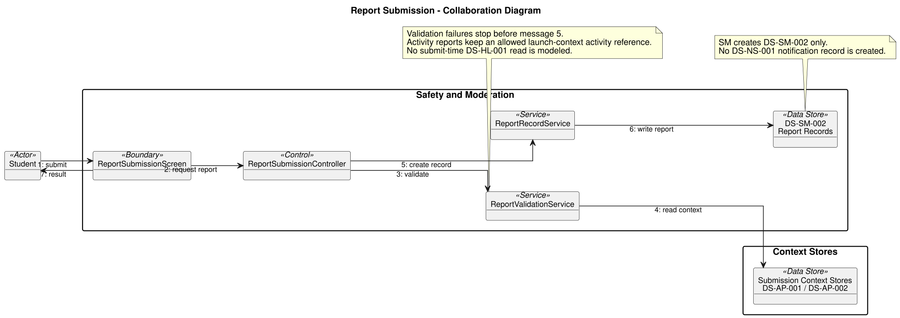
<figcaption>Figure 6.15: Original collaboration diagram - Report Submission.</figcaption>
</figure>
</div>

<div class="figure-page landscape">
<figure>
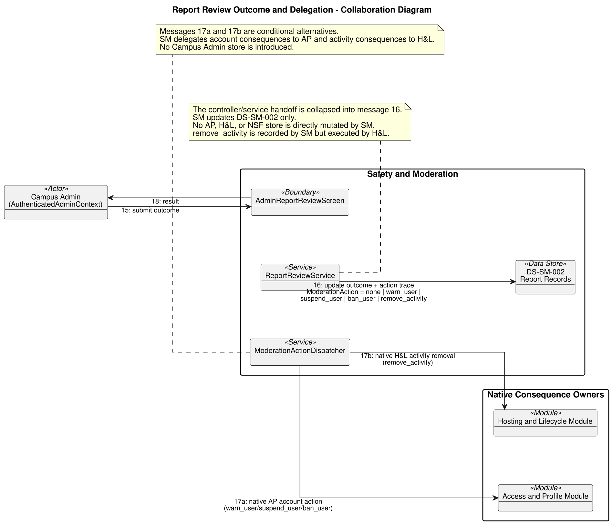
<figcaption>Figure 6.16: Original collaboration diagram - Report Review and Delegation.</figcaption>
</figure>
</div>

<div class="figure-page landscape">
<figure>
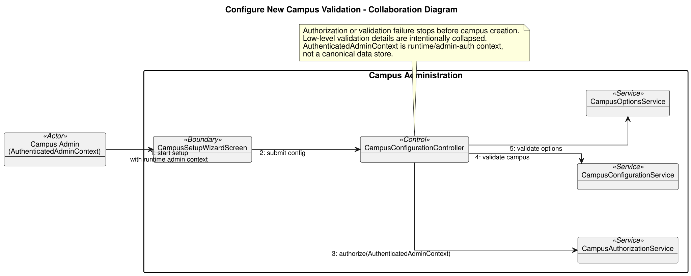
<figcaption>Figure 6.17: Original collaboration diagram - Configure New Campus.</figcaption>
</figure>
</div>

<div class="figure-page landscape">
<figure>
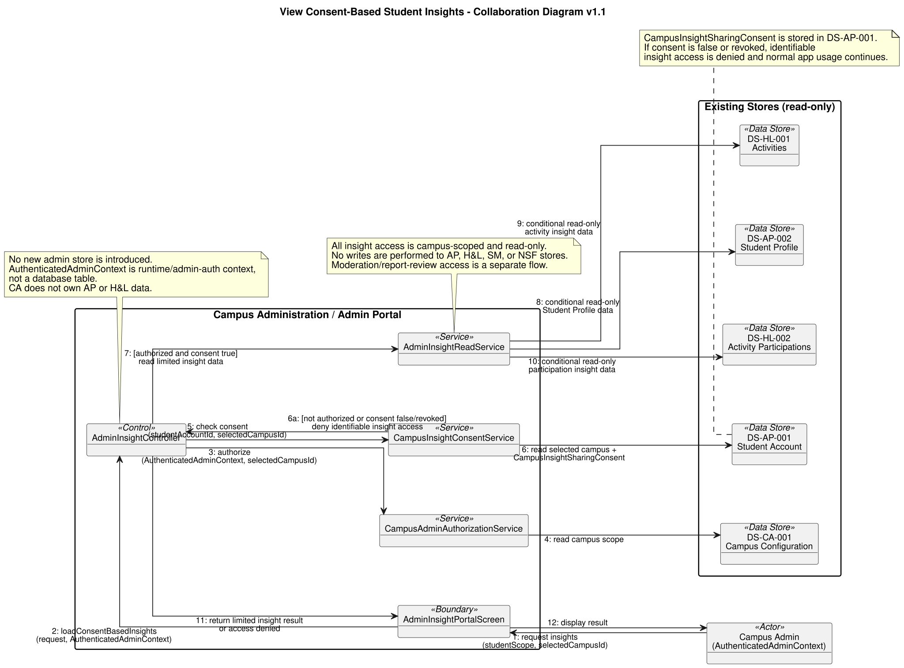
<figcaption>Figure 6.18: Original collaboration diagram - Consent-Based Student Insights.</figcaption>
</figure>
</div>

## 6.6 Lifecycle and Activity Diagrams

The state charts define persistence-based and derived states. Participation uses RecordType plus Status to avoid ambiguity; StudentProfile status is derived from account status; ReportRecord separates review status from moderation action trace.

<div class="figure-page landscape">
<figure>
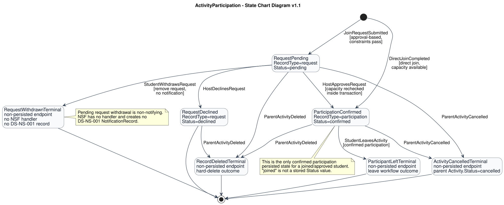
<figcaption>Figure 6.19: Original state chart - Activity Participation.</figcaption>
</figure>
</div>

<div class="figure-page landscape">
<figure>

<figcaption>Figure 6.20: Original state chart - Student Profile.</figcaption>
</figure>
</div>

<div class="figure-page landscape">
<figure>
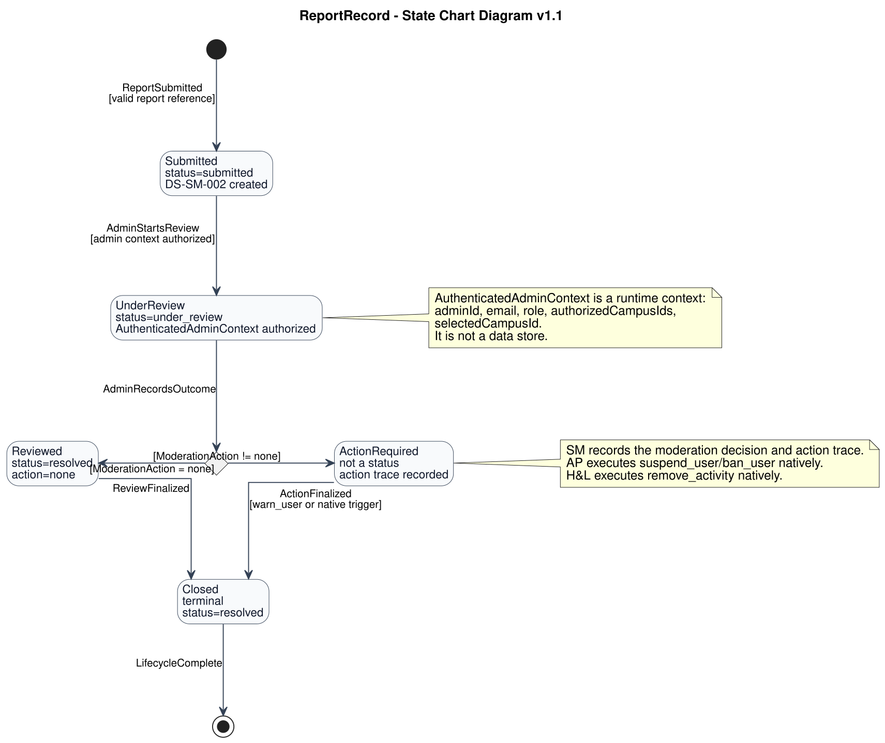
<figcaption>Figure 6.21: Original state chart - Report Record.</figcaption>
</figure>
</div>

<div class="figure-page landscape">
<figure>
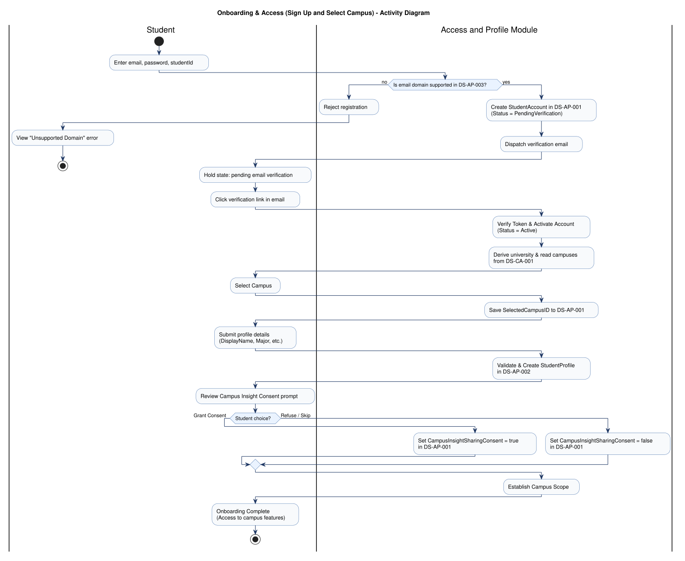
<figcaption>Figure 6.22: Original activity diagram - Onboarding and Access.</figcaption>
</figure>
</div>

<div class="figure-page landscape">
<figure>
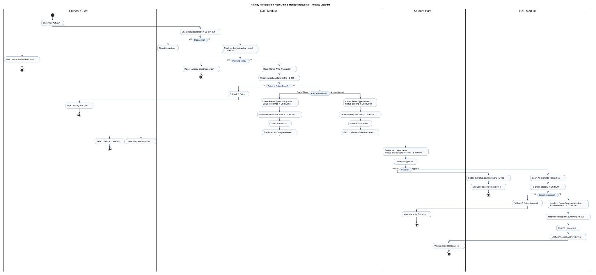
<figcaption>Figure 6.23: Original activity diagram - Activity Participation Flow.</figcaption>
</figure>
</div>

<div class="figure-page landscape">
<figure>
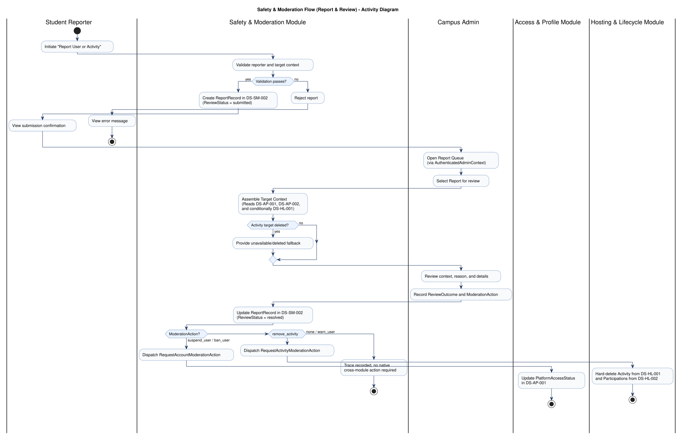
<figcaption>Figure 6.24: Original activity diagram - Safety and Moderation Flow.</figcaption>
</figure>
</div>

## 6.7 Component Model

The component diagram shows the modular monolith as six backend modules, a mobile frontend, shared contracts, the event dispatcher, internal command interfaces, and the shared PostgreSQL persistence layer. It reinforces that shared persistence is not shared ownership.

<div class="figure-page landscape">
<figure>
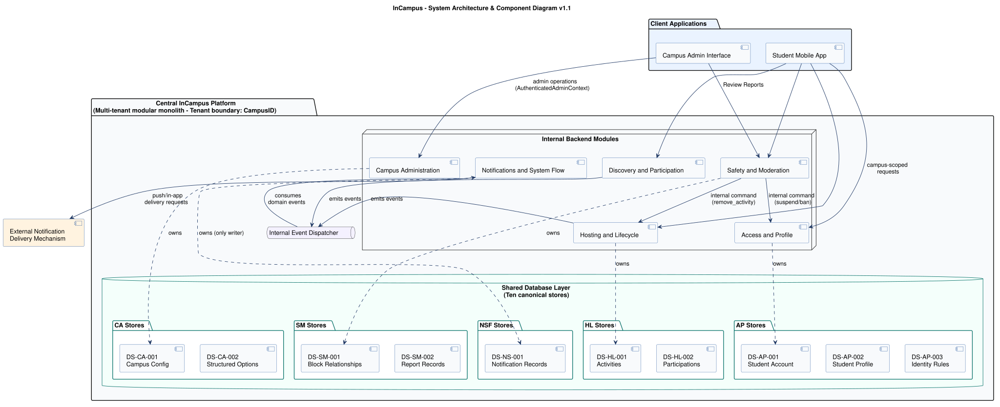
<figcaption>Figure 6.25: Original component diagram recovered from the Object-Oriented Design Report DOCX media.</figcaption>
</figure>
</div>

# 7. Implementation and Development Artifacts

## 7.1 Private Repository Access

“For intellectual property and future commercialization reasons, the repository is maintained as private. The development artifacts are available to the teaching staff upon request through controlled GitHub collaborator access.”

Private controlled-access repository reference: `https://github.com/InCampus-dev/InCampusApp`.

This report does not expose source-code dumps. It documents architecture, route groups, workflows, tests, and evidence at the level needed for assessment while preserving private implementation IP.

## 7.2 Monorepo Organization

| Area | Role |
| --- | --- |
| `backend` | TypeScript/Express/TypeORM backend modules, routes, services, entities, migrations, tests, seed/smoke tooling. |
| `mobile` | React Native/Expo mobile application, screens, services, navigation, tests. |
| `docs` | API contracts, error/event/internal command contracts, setup/runbook, demo readiness, QA notes. |
| `Documentation` / `documentation` | Affine-exported requirements, data model, diagrams, architecture, and design workdocs. |
| `codingOrganization` | Repository organization and planning support material where present. |

## 7.3 Backend Implementation

The backend is implemented with TypeScript, Express, TypeORM, PostgreSQL, npm workspaces, Vitest, and ESLint. Route groups map to the design modules.

| Subsystem | Implemented Route Groups |
| --- | --- |
| Access and Profile | `/auth/signup`, `/auth/verify-email`, `/auth/signin`, `/campuses`, `/accounts/me/campus`, `/accounts/me/consent`, `/accounts/me/insight-consent`, `/profiles`, `/profiles/me`, `/activities/:id/profiles/:studentAccountId`. |
| Campus Administration | `/admin/campuses`, `/admin/campuses/:campusId/structured-options`, `/admin/campuses/:campusId/student-insights`. |
| Hosting and Lifecycle | `/activities`, `/activities/:activityId/requests`, `/activities/:activityId/requests/:requestId`, `/activities/:activityId/status`, `DELETE /activities/:activityId`. |
| Discovery and Participation | `GET /activities`, `GET /activities/:activityId`, `POST /activities/:activityId/join`, `DELETE /activities/:activityId/requests/me`, `DELETE /activities/:activityId/participants/me`, `GET /profiles/me/activities`. |
| Safety and Moderation | `/reports`, `/admin/campuses/:campusId/reports`, `/admin/campuses/:campusId/reports/:reportId/review`, `/blocks`, `/community-rules`. |
| Notifications and System Flow | `/notifications`, `/notifications/:notificationId/context`, internal event handlers for join, decision, leave, cancellation, and reminder events. |

## 7.4 Mobile Implementation

The mobile app is implemented with React Native/Expo and service-layer tests. Current screens cover onboarding, profile, consent, feed, activity details, create activity, manage requests, notifications, personal activities, safety tools, and demo admin workflows.

| Workflow | Mobile Surface |
| --- | --- |
| Student onboarding | Sign Up, verification flow support, Sign In, Campus Selection, Profile Setup. |
| Student profile and consent | Mine/Profile, Profile Setup/Edit, Consent Settings. |
| Activity discovery | Activity Feed, filters, Activity Details. |
| Activity hosting | Create Activity, Manage Requests, update/cancel/delete where supported. |
| Participation | Direct join, approval request, withdraw pending request, leave joined activity. |
| Notifications | Notification List, context routing, fallback screen. |
| Safety | Report Submission, Block User, Community Rules, contextual Student Profile. |
| Campus admin demo | Admin Dashboard, Structured Options, Reports, Report Detail, Admin Insights. |

## 7.5 Current Implementation Status

The course MVP is implemented sufficiently for guided local/demo use and automated verification. It is not claimed as production-ready.

| Status Area | Verified Status |
| --- | --- |
| Automated regression | 280 passing automated tests verified locally: 260 backend and 20 mobile. |
| Backend CI | Successful GitHub Actions backend checks include install, lint, build, test, migrations, seed, backend start, and smoke. |
| Mobile CI | Successful GitHub Actions mobile checks include install and typecheck. |
| Email | Real email delivery remains mock/console-based. |
| Push | Real push delivery remains stub/log-based; notification records and contexts are implemented. |
| Reminder scheduling | Reminder handler exists, but production scheduler hardening remains future work. |
| Admin UI | Demo/admin screens exist; production admin IAM and hardening remain incomplete. |
| Mobile structured options | Implemented in current mobile/backend flow, not listed as missing. |
| Withdraw/leave | Implemented in current mobile/backend flow, not listed as missing. |

# 8. Testing and Quality Assurance

## 8.1 CI Workflow

The repository CI workflow defines backend and mobile checks. Backend checks install dependencies, lint, build, test, run migrations, seed demo data, start the backend, and execute the demo smoke check. Mobile checks install dependencies and run the mobile TypeScript typecheck.

| Branch | Run ID | SHA | Evidence | Result |
| --- | --- | --- | --- | --- |
| `main` | `26859944398` | `59c382206540d634c1413448325082189aae9a9b` | `gh api repos/InCampus-dev/InCampusApp/actions/runs/26859944398/jobs` | Backend checks success; Mobile checks success. |
| `feature/granular-campus-insights-consent` | `26859628823` | `1baf47541a09f766c43d38783073d7c80ebbce35` | `gh api repos/InCampus-dev/InCampusApp/actions/runs/26859628823/jobs` | Backend checks success; Mobile checks success. |

Raw CLI evidence is included in Appendix I.

## 8.2 Local Verification

| Test Layer | Tool/Command | Scope | Verified Result |
| --- | --- | --- | --- |
| Backend unit/integration | `npm test --workspace backend` | Services, routes, event handlers, architectural invariants | 31 files, 260 tests passed. |
| Mobile service tests | `npm test --workspace mobile` | API/service helpers, notification fallback copy, activity actions/capacity | 5 files, 20 tests passed. |
| Backend lint | `npm run lint --workspace backend` | Backend TypeScript lint rules | Passed. |
| Mobile typecheck | `npm run typecheck --workspace mobile` | Mobile TypeScript compile contract | Passed. |
| CI backend | GitHub Actions | Install, lint, build, test, migrate, seed, start, smoke | Successful runs verified. |
| CI mobile | GitHub Actions | Install and typecheck | Successful runs verified. |

Combined automated regression count: 280 passing tests.

## 8.3 Regression Scope

The test suite protects onboarding, campus scoping, profile creation, insight consent, activity creation, feed/detail behavior, join/request flows, withdraw/leave, host approval/decline, notification event handling, notification context opening, reports, blocking, community rules, consent-based insights, and ownership invariants such as event-only notification writes and moderation command delegation.

## 8.4 QA Limitations

The project does not claim full production end-to-end testing. Real email and push integrations are not covered by integration tests because the current delivery mechanisms are mock/console or stub/log based. Mobile UI has service tests and implemented screens, but complete device-level E2E automation is not present. Admin screens are demo/admin surfaces rather than a production staff IAM implementation.

# 9. User Documentation and User Manual

## 9.1 Student User Manual

### 9.1.1 Sign Up, Verify, and Sign In

1. Open InCampus and choose sign up.
2. Enter a supported university email address.
3. Submit the sign-up form and wait for the verification step.
4. Complete email verification using the code or link provided by the system.
5. Return to the app and sign in with the verified account.

### 9.1.2 Select Campus and Set Up Profile

1. After sign-in, review the campuses associated with the verified university identity.
2. Select Tongji University, Jiading Campus when it is the correct campus.
3. Create the student profile with minimal public information such as display name, major/interests, and short profile details.
4. Edit the profile later from the profile or mine area if details change.

### 9.1.3 Manage Campus Insight Consent

1. Open Consent Settings.
2. Review what consent-based insights mean: authorized campus staff may only access supported student-interest/activity insight data when consent is granted.
3. Grant, refuse, or revoke consent.
4. Normal app access continues regardless of the consent choice.

### 9.1.4 Browse, Filter, and View Activities

1. Open the activity feed.
2. Browse available activities in the selected campus.
3. Apply filters such as category, time, location, or other structured options when available.
4. Open an activity to view details: title, host, schedule, place, capacity, participation mode, description, and current availability.

### 9.1.5 Create an Activity

1. Choose create activity.
2. Select category and meeting location from campus structured options.
3. Add title, description, date/time, capacity, and participation mode.
4. Review the details and submit.
5. The activity appears in the campus feed if it is open and discoverable.

### 9.1.6 Join, Request, Withdraw, and Leave

1. Open an activity detail page.
2. If the activity allows direct join and has capacity, choose join.
3. If the activity requires approval, choose request to join.
4. If a pending request is no longer desired, withdraw the request from the activity detail page.
5. If already joined and no longer available, leave the activity before it starts where supported by the current activity state.

### 9.1.7 Manage Requests as Host

1. Open the hosted activity or the manage requests screen.
2. Review pending join requests and applicant profile snippets.
3. Approve a request when capacity and activity state allow it.
4. Decline a request when the applicant should not join.
5. The system updates participation status and notifies the applicant.

### 9.1.8 Hosted Activity Changes

1. Open the hosted activity.
2. Use available actions to update status, cancel, or delete where supported and allowed.
3. Cancellation notifies affected participants when notification records are enabled.
4. Deletion removes the activity according to the current lifecycle rules.

### 9.1.9 Notifications and Personal Activity List

1. Open notifications to see participation, host, cancellation, or reminder records.
2. Open a notification to navigate to the relevant context.
3. If the target is unavailable, blocked, deleted, or no longer accessible, the fallback screen explains the situation.
4. Open the personal activity list to see upcoming and past activity participation contexts.

### 9.1.10 Report, Block, and Community Rules

1. Use report when a user or activity appears unsafe, inappropriate, or unsuitable.
2. Provide the report reason and submit.
3. Use block to avoid further supported interactions with another user.
4. Read community rules from the safety/community area before using participation features.

## 9.2 Campus Admin User Manual

### 9.2.1 Controlled Admin Access

Campus admin access is controlled and scoped. Admins should only operate inside their authorized campus context. Production staff identity hardening remains a future-work item, so course/demo admin surfaces should be treated as controlled demonstration tools.

### 9.2.2 Configure Campus and Structured Options

1. Open the admin dashboard.
2. Configure campus information where authorized.
3. Manage structured options such as activity categories and campus locations.
4. Add, update, or deactivate options carefully because students use them during activity creation and filtering.

### 9.2.3 Review Reports and Record Outcomes

1. Open the campus report queue.
2. Select a report to inspect reporter, target, reason, status, and available context.
3. Record an outcome.
4. When a moderation consequence is needed, the system routes the consequence to the proper owner module rather than letting the admin screen directly mutate unrelated stores.

### 9.2.4 Consent-Based Student Insights

1. Open Admin Insights.
2. Review only students within the authorized campus scope.
3. Understand that identifiable profile/participation insight data is available only for students who granted consent.
4. Students who refuse or revoke consent must not be treated as data gaps to bypass; the restriction is part of the privacy model.

## 9.3 Common Errors and Troubleshooting

| Situation | Meaning | User Action |
| --- | --- | --- |
| Unsupported email domain | The university identity rule does not support the submitted domain. | Use the official university email or contact support/admin. |
| Verification not completed | Account exists but is not active yet. | Complete verification before signing in. |
| Campus unavailable | No campus association was found for the verified identity or selected campus. | Recheck the account/campus selection. |
| Activity full | Capacity has been reached, possibly due to a concurrent join. | Choose another activity or wait for capacity to change. |
| Already joined/requested | A participation or pending request already exists. | Use withdraw/leave if available. |
| Target unavailable | The referenced activity/user was deleted, blocked, or no longer accessible. | Return to the feed or personal list. |
| Consent off | Admin insight data is not shown because the student has not granted consent. | No action required unless the student chooses to change consent. |

# 10. Project Management and Time Management

## 10.1 Work Breakdown Structure

The WBS separated the project into requirements, analysis, UI requirements, architecture/design, implementation, QA, documentation, and final consolidation. The original requirements report identifies the core sequence: user stories, FR/NFRs, use cases, DFDs, CRUD, ERD, UI requirements, and time-management outputs.

| WBS Area | Main Outputs |
| --- | --- |
| Requirements gathering | User stories, FR table, NFR table, traceability. |
| Requirement analysis | Use case diagram, narratives, priority matrix, DFDs, CRUD matrix, ERD. |
| UI requirements | Screen inventory, global constraints, user-facing state requirements. |
| Object-oriented design | Architecture, class diagram, SSDs, sequence, collaboration, state, activity, component diagrams. |
| Implementation | Backend modules/routes, mobile screens/services, seed/smoke scripts. |
| QA | Backend/mobile tests, lint/typecheck, CI checks, smoke verification. |
| Final documentation | Unified final report, appendices, evidence, user manual. |

## 10.2 Critical Path and Slack

The critical path follows artifact dependency order. User stories must precede FR/NFRs; FR/NFRs must precede use cases; use cases and DFDs must precede CRUD and entity modeling; entity/relationship modeling must precede object design and implementation planning. Formatting, presentation, and visual polish have slack because they can run after the core traceability chain is stable.

| Critical Task | Dependency | Slack Interpretation |
| --- | --- | --- |
| User story finalization | Project idea and validation | Low slack because all later requirements depend on it. |
| FR/NFR derivation | User stories | Low slack because use cases and tests trace to these IDs. |
| Use case model | FR/NFRs | Low slack because DFD/design scenarios depend on use cases. |
| DFD and CRUD | Use cases and stores | Low slack because ownership rules depend on this validation. |
| Entity/relationship model | CRUD and data stores | Low slack for object design consistency. |
| UI requirements | Use cases and NFRs | Moderate slack, but must remain aligned with MVP scope. |
| Final report formatting | Completed artifacts | Higher slack; can be done after content is stable. |

## 10.3 Cost-Benefit Estimate

The project is feasible as a course MVP because the core value is delivered by a focused activity coordination loop, not by broad platform features. The main cost comes from cross-module correctness: identity, campus scoping, capacity, notifications, moderation, and consent must be consistent. The benefit is a coherent product that can later be extended to institutional partnerships without rewriting the conceptual architecture.

| Cost Area | Benefit |
| --- | --- |
| Verified identity and campus scoping | Safer, more trusted student interaction boundary. |
| Modular backend design | Clear ownership, easier testing, fewer hidden cross-module mutations. |
| Automated regression suite | Protects core flows and supports faster iteration. |
| Consent-based admin insights | Allows institutional value while respecting student privacy. |
| Private repository/IP control | Preserves future commercialization options. |

# 11. Limitations and Future Work

## 11.1 Course MVP Completion

The course MVP is coherent from requirements to implementation. The core student loop, host controls, safety tools, admin configuration, consent-based insights, backend contracts, mobile screens, and automated tests are present. The implementation is appropriate for a guided local/demo environment.

## 11.2 Alpha and Demo Limitations

The implementation still has alpha/demo limitations. Real email delivery is mock/console-based. Real push delivery is stub/log-based. The reminder handler exists but production scheduling is not hardened. Admin UI exists as demo/admin screens, while production staff IAM and institutional hardening are incomplete. Full production E2E automation is not yet present.

## 11.3 Future Roadmap

Future work should prioritize production email/push integrations, scheduler hardening, staff IAM, device-level E2E tests, institutional onboarding processes, Chinese localization, accessibility review, richer admin audit trails, and careful Post-MVP expansion such as friend indicators, messaging, points, or shared post-activity photos only after the activity-first trust model remains stable.

# 12. Conclusion

InCampus is a complete software engineering project in the course sense: it begins with a concrete campus problem, derives traceable requirements, validates data and use case models, defines a modular architecture, implements the MVP in backend and mobile code, verifies the system through automated tests and CI evidence, and provides user-facing documentation. Its strongest engineering qualities are the CampusID tenant boundary, module ownership discipline, event-driven notifications, moderation command delegation, and privacy-by-design consent handling. The repository remains private for legitimate IP and future commercialization reasons, while development evidence can be made available to teaching staff through controlled collaborator access.

# Appendices

## Appendix A - Full User Story Table

Original Affine-exported source table.

##### User Story v1.3
##### Version log

\| 1.3 | 2026-05-08 | Final pre-skeleton alignment | Aligned Activity Reminder priority, Student Profile naming, and consent-based admin insight wording with the final accepted MVP decisions. | Required before using the requirements as input for the first code architecture skeleton. | Final documentation review + team decisions 2026-05-08 |

\| 1.2 | 2026-05-01 | Admin student insight user story | Added a Campus Admin user story for consent-based access to student interest and activity-participation insights within the admin’s authorized campus scope. | The student-side consent story needed a corresponding admin-side use case to define who consumes the consent-based insight data and under which boundaries. | Student insight access analysis |

\| 1.1 | 2026-05-01 | Student consent user story | Added a user story allowing students to control whether their non-academic interest and participation data may be shared with authorized campus staff. | The new campus insight direction must be grounded in student consent rather than implicit admin access. | Student insight access analysis |

| US-ID           | User Story                                                                                                                                                                                                                                                                                                  | Created by           | Created time | US-11        | Related to FR                                       | Function                      | Related to NFR                     | Priority |
| --------------- | ----------------------------------------------------------------------------------------------------------------------------------------------------------------------------------------------------------------------------------------------------------------------------------------------------------- | -------------------- | ------------ | ------------ | --------------------------------------------------- | ----------------------------- | ---------------------------------- | -------- |
| US-01           | As a student, I can sign up with my university email so that i’m sure only university users can access the app and i feel safer                                                                                                                                                                             | Francesco Nativitati | 2026-04-03   | Student      | FR-101,FR-102,FR-103,FR-104,FR-105                  | Access and Identity           | NFR-01,NFR-02,NFR-03,NFR-05,NFR-04 | MVP      |
| US-02           | As a campus admin, I can review reports about inappropriate users or activities so that unsafe or unsuitable behavior can be handled.                                                                                                                                                                       | Francesco Nativitati | 2026-04-03   | Campus Admin | FR-201,FR-202,FR-203                                | Safety and Moderation         | NFR-09,NFR-08,NFR-07,NFR-06        | MVP      |
| US-03       | As a student, I want to create a new activity by selecting a category, adding details, and setting a participant limit, so that I can find other students to share an ordinary campus moment with.                                                                                                          | SSilvestro Matteo    | 2026-04-04   | Student      | FR-301,FR-302,FR-303,FR-304,FR-305                  | Activity Management           | NFR-13,NFR-11,NFR-10               | MVP      |
| US-04       | As a student, I want to browse through the activities and with a filter, so that I can choose the activity to participate in based on my personal preference. (e.g. type/time/gender etc.)                                                                                                                  | SSilvestro Matteo    | 2026-04-04   | Student      | FR-401,FR-402,FR-403,FR-405,FR-404,FR-406           | Activity Management           | NFR-11,NFR-16,NFR-17               | MVP      |
| US-05       | As an activity host, I want to review join requests and manage the status of my activity, so that I can control who attends and keep the campus feed accurate.                                                                                                                                              | AANJOSOUS            | 2026-04-04   | Student      | FR-502,FR-503,FR-501,FR-305,FR-2001,FR-2002,FR-1403 | Activity Management           | NFR-13,NFR-12                      | MVP      |
| US-06       | As an activity host, I want to receive an instant notification when someone requests to join or directly join (when allowed) my activity, so that i can quickly manage participation and stay updated on who is attending.                                                                                  | Francesco Nativitati | 2026-04-04   | Student      | FR-601,FR-602,FR-603,FR-2001                        | Activity Management           | NFR-15,NFR-14                      | MVP      |
| US-07       | As a participant, I want to receive an instant notification when my application for the event is approved or declined, so that I can stay up-dated to my participation status.                                                                                                                              | AANJOSOUS            | 2026-04-04   | Student      | FR-701,FR-702,FR-703,FR-704,FR-2002                 | Activity Management           | NFR-18,NFR-19                      | MVP      |
| US-08       | As a student, I want Message functions so that I can text to others (probably the students I met in previous events) or forward the link of a specific activity to them.                                                                                                                                    | AANJOSOUS            | 2026-04-04   | Student      | FR-801,FR-802,FR-803                                | Personal and Social Area      | NFR-20,NFR-21                      | postMVP  |
| US-09       | As a student, I want to have a clear list of: My History Events and Events to Participate.                                                                                                                                                                                                                  | AANJOSOUS            | 2026-04-04   | Student      | FR-901,FR-902                                       | Personal and Social Area      | NFR-22                             | MVP      |
| US-10       | As a student I want to see a page dedicated to my friends/connection and if one of my friend is in an activity on my feed, I want to see “2 of your friends joined”                                                                                                                                         | Jacopo Donati        | 2026-04-05   | Student      | FR-1001,FR-1002                                     | Personal and Social Area      | NFR-23                             | postMVP  |
| US-11       | As a student I want to receive a notification 5 minutes before the starting of the activite I joined, otherwise I will forget                                                                                                                                                                               | Jacopo Donati        | 2026-04-05   | Student      | FR-1101                                             | Activity Management           | NFR-24                             | MVP      |
| US-12       | As a student I want to receive points from attending an activity and if I join and then I forget/refuse to go I have to lose points                                                                                                                                                                         | Jacopo Donati        | 2026-04-05   | Student      | FR-1201                                             | Personal and Social Area      | NFR-25                             | postMVP  |
| US-13       | As a student, after attending an activity I want to remember it so I want to upload a photo of all the group SMILING to the activity page, so I will watch it in future and cry                                                                                                                             | Jacopo Donati        | 2026-04-05   | Student      | FR-1301                                             | Personal and Social Area      | NFR-26                             | postMVP  |
| US-14       | As a student, immediately after the registration of the account I can create and edit my Student Profile with minimal public profile data so that other students can recognize me enough to feel safe joining or accepting activities.                                                                       | Francesco Nativitati | 2026-04-05   | Student      | FR-1401,FR-1402,FR-1403                             | User Profile                  | NFR-28,NFR-27                      | MVP      |
| US-15       | As a student, I can sign in to my verified account with my password so that I can access the app again without creating a new account.                                                                                                                                                                      | Francesco Nativitati | 2026-04-05   | Student      | FR-1501                                             | Access and Identity           | NFR-29                             | MVP      |
| US-16       | As a student, during onboarding I can confirm or select my campus from the campuses associated with my university so that I access the correct campus environment and only see relevant activities                                                                                                          | Francesco Nativitati | 2026-04-05   | Student      | FR-105,FR-1601                                      | Access and Identity           | NFR-30                             | MVP      |
| US-17           | As a student, I can report an inappropriate user or activity so that unsafe or unsuitable situations can be reviewed and handled.                                                                                                                                                                           | Francesco Nativitati | 2026-04-05   | Student      | FR-201,FR-202,FR-203,FR-1701                        | Safety and Moderation         | NFR-06,NFR-08,NFR-31               | MVP      |
| US-18           | As a student, I can block another user so that I can avoid further unwanted interaction and feel safer using the app.                                                                                                                                                                                       | Francesco Nativitati | 2026-04-05   | Student      | FR-1801,FR-1802                                     | Safety and Moderation         | NFR-32                             | MVP      |
| US-19       | As a student, I can view the community rules so that I understand what behavior is expected before using the app and joining activities.                                                                                                                                                                    | Francesco Nativitati | 2026-04-05   | Student      | FR-1901                                             | Safety and Moderation         | NFR-33                             | MVP      |
| US-20   | As a student, I can request to join an activity or join it directly when allowed, so that I can participate in campus activities with low friction.                                                                                                                                                         | Francesco Nativitati | 2026-04-05   | Student      | FR-305,FR-2001,FR-2002,FR-502                       | Activity Management           | NFR-13,NFR-34                      | MVP      |
| US-21       | As a student, I can view the essential details of an activity before joining, so that I can decide whether it fits my time, interest, and availability.                                                                                                                                                     | Francesco Nativitati | 2026-04-05   | Student      | FR-302,FR-402                                       | Activity Management           | NFR-35                             | MVP      |
| US-22       | As a student, I can view another student’s Student Profile in relevant activity contexts, limited to minimal public profile data, so that I can decide whether I feel comfortable joining or accepting an activity.                                                                                       | Francesco Nativitati | 2026-04-05   | Student      | FR-501,FR-1403                                      | User Profile                  | NFR-36,NFR-28                      | MVP      |
| US-23       | As a campus admin of a new campus, I can configure the campus-specific setup of the app through a small number of guided steps so that the app can operate correctly in my campus without requiring a new version of the system.                                                                            | Francesco Nativitati | 2026-04-05   | Campus Admin | FR-2301,FR-2302                                     | Campus config and scalability | NFR-38,NFR-37                      | MVP      |
| US-24       | As a campus admin, I can manage campus-specific structured options such as locations and activity lists so that students in my campus see relevant and usable choices.                                                                                                                                      | Francesco Nativitati | 2026-04-05   | Campus Admin | FR-301,FR-304,FR-2302                               | Campus config and scalability | NFR-40,NFR-39                      | MVP      |
| US-25           | As a student host, I can set the date and time of an activity when I create it, so that other students can understand when it will happen and decide whether they can join.                                                                                                                                 |                      |              | Student      | FR-2501,FR-2502,FR-402,FR-404                       | Activity Management           | NFR-10,NFR-41                      | MVP      |
| US-26           | As an activity host, I can delete an activity I created before it starts, so that I can remove it if it was created by mistake or should no longer be published.                                                                                                                                            |                      |              | Student      | FR-2601,FR-2602,FR-2603                             | Activity Management           | NFR-42,NFR-12                      | MVP      |
| US-27           | As a student, I can withdraw my pending join request or leave an activity I joined before it starts, so that I can update my participation when I am no longer available.                                                                                                                                   |                      |              | Student      | FR-2701,FR-2702,FR-2703,FR-2704,FR-901              | Activity Management           | NFR-43,NFR-13,NFR-22               | MVP      |
| US-28           | As a participant, I want to receive an instant notification when an activity I joined is cancelled, so that I immediately know that I no longer have that appointment.                                                                                                                                      |                      |              | Student      | FR-2801,FR-2802,FR-2803,FR-2804,FR-503              | Activity Management           | NFR-44,NFR-19                      | MVP      |
| US-29           | As a student, I can choose whether my profile interests and activity participation data may be shared with authorized campus staff, so that I remain in control of how my non-academic campus-life data is used.                                                                                            |                      |              | Student      | FR-2901,FR-2902,FR-2903                             | Access and Identity           | NFR-45,NFR-46,NFR-47               | MVP      |
| US-30           | As an authorized campus admin, I can view consent-based student interest and activity-participation insights for students within my authorized campus scope, so that campus departments can better understand non-academic student interests without accessing data from students who did not give consent. |                      |              | Campus Admin | FR-2902,FR-2903,FR-3001                             | Campus config and scalability | NFR-45,NFR-46,NFR-47               | MVP      |

## Appendix B - Full Functional Requirements

Original Affine-exported source table.

##### Functional Requirements v1.3
##### Version log

\| 1.3 | 2026-05-08 | Final pre-skeleton alignment | Aligned Student Profile naming, report submit/review boundary, moderation routing, cancellation/deletion behavior, and consent-based admin insight handling with the final accepted decisions. | Required before using the requirements as input for the first code architecture skeleton. | Final documentation review + team decisions 2026-05-08 |

\| 1.2 | 2026-05-01 | Admin insight access requirement | Added `FR-3001` to define authorized campus admin access to consent-based student interest and activity-participation insight data. | The admin-side capability must be explicitly documented instead of being implied by existing moderation or campus configuration access. | Student insight access analysis |

\| 1.1 | 2026-05-01 | Consent-based insight requirements | Added functional requirements for student consent, consent-based admin restriction, and campus-scoped insight access. | The project may support campus-level student-life insight initiatives, but identifiable data access must be explicitly consent-based. | Student insight access analysis |

| FR-ID             | Functional Requirement                                                                                                                                                                                                  | Created by           | Created time | Traceability      |
| ----------------- | ----------------------------------------------------------------------------------------------------------------------------------------------------------------------------------------------------------------------- | -------------------- | ------------ | ----------------- |
| FR-0101           | The system shall allow a user to enter a university email address during registration.                                                                                                                                  | Francesco Nativitati | 2026-04-03   | US-01             |
| FR-0102           | The system shall reject registration attempts made with unsupported or non-university email domains.                                                                                                                    | Francesco Nativitati | 2026-04-03   | US-01             |
| FR-0103           | The system shall send a verification email to the provided university email address.                                                                                                                                    | Francesco Nativitati | 2026-04-03   | US-01             |
| FR-0104           | The system shall activate the account only after the email address has been verified.                                                                                                                                   | Francesco Nativitati | 2026-04-03   | US-01             |
| FR-0105           | The system shall determine the user’s university from the verified email domain and present the campuses associated with that university during onboarding                                                              | Francesco Nativitati | 2026-04-03   | US-01,US-16       |
| FR-0201           | The system shall allow a campus admin to access and review submitted reports about users or activities, including the reason and relevant report details.                                                               | Francesco Nativitati | 2026-04-03   | US-02,US-17       |
| FR-0202           | The system shall allow a campus admin to mark a report as reviewed and record the review outcome.                                                                                                                       | Francesco Nativitati | 2026-04-03   | US-02,US-17       |
| FR-0203           | The system shall allow a campus admin to record moderation action on a reported user or activity after review; user consequences are executed through AP-native workflows and activity removal through H&L-native workflows. | Francesco Nativitati | 2026-04-03   | US-02,US-17       |
| FR-0301           | The system shall allow a student host to select an activity category from a predefined campus-specific list.(e.g., lunch, coffee, study time, sport). then the user add details                                         | Francesco Nativitati | 2026-04-03   | US-03,US-24       |
| FR-0302           | (change user that created the requirement) The system shall provide a text input field for the host to specify additional activity details or context.                                                                  | Francesco Nativitati | 2026-04-03   | US-03,US-21       |
| FR-0303           | The system shall allow the host to set a maximum number of participants, ranging from 1-to-1 interactions up to a predefined small group limit.                                                                         | SSilvestro Matteo    | 2026-04-04   | US-03             |
| FR-0304           | The system shall allow the host to specify a meeting point by selecting from a predefined list of campus locations or from a map of the campus                                                                          | SSilvestro Matteo    | 2026-04-04   | US-03,US-24       |
| FR-0305           | The system shall allow the host to define whether participation requires approval or is open to anyone until full                                                                                                       | SSilvestro Matteo    | 2026-04-04   | US-03,US-05,US-20 |
| FR-0406           | The system shall display the filtered result with a predefined order (e.g. time posted)                                                                                                                                 | SSilvestro Matteo    | 2026-04-04   | US-04             |
| FR-0501           | The system shall display a list of pending join requests to the activity host, showing the Student Profile minimal public data of the requesting students.                                                              | SSilvestro Matteo    | 2026-04-04   | US-05,US-22       |
| FR-0502           | The system shall automatically block new join requests when the maximum number of pending requests or confirmed participants is reached.                                                                               | SSilvestro Matteo    | 2026-04-04   | US-05,US-20       |
| FR-0503           | The system shall allow the host to manually update the overall status of the activity (e.g., changing it to cancelled, or marking it as completed)                                                                      | SSilvestro Matteo    | 2026-04-04   | US-05,28          |
| FR-0601           | The system shall trigger a notification to the activity host when a user request to join an approval based activity or directly joins an open activity                                                                  | Francesco Nativitati | 2026-04-04   | US-06             |
| FR-0602           | The notification shall clearly indicate the relevant activity and the type of event such as a new join request or a new participant                                                                                     | Francesco Nativitati | 2026-04-04   | US-06             |
| FR-0603       | When the host taps the notification, the system shall open the relevant activity inside the app and display the appropriate view, allowing the host to manage the request or see the updated participant details        | Francesco Nativitati | 2026-04-04   | US-06             |
| FR-0701       | The system shall detect in real time when a pending join request receives a host decision that results in `Participation.Status = confirmed` or `Participation.Status = declined`.                                     | AANJOSOUS            | 2026-04-04   | US-07             |
| FR-0702       | The system shall trigger a notification to the applicant when the host decision results in a confirmed or declined participation/request outcome.                                                                        | AANJOSOUS            | 2026-04-04   | US-07             |
| FR-0703       | The notification content shall include at least: event name, application result (approved/declined), event time.                                                                                                        | AANJOSOUS            | 2026-04-04   | US-07             |
| FR-0704   | Participants shall be able to view all historical application status notifications in their personal message center or notification list.                                                                               | AANJOSOUS            | 2026-04-04   | US-07             |
| FR-0401           | The system shall provide a browse interface where students can view a list of available activities.                                                                                                                     | AANJOSOUS            | 2026-04-04   | US-04             |
| FR-0402           | The system shall display the essential details of each activity before joining, including at least title, activity category, host, time, location, current number of participants, and any additional activity details. | AANJOSOUS            | 2026-04-04   | US-04,US-21,US-25 |
| FR-0403       | The system shall not display a post if the number of participants reach the limit set.                                                                                                                                  | AANJOSOUS            | 2026-04-04   | US-04             |
| FR-0404       | The system shall support filtering of activities by activity category (e.g. sports, social, academic, meal etc.); time (e.g. start time, end time etc.); gender (e.g. male, female, all-acceptable).                    | AANJOSOUS            | 2026-04-04   | US-04,US-25       |
| FR-0405           | The filter shall allow students to apply multiple perference simultaneously.                                                                                                                                            | AANJOSOUS            | 2026-04-04   | US-04             |
| FR-0801       | The system shall provide a messaging function that allows a student to send direct text messages to another student.                                                                                                    | Francesco Nativitati | 2026-04-04   | US-08             |
| FR-0802       | The system shall allow a student to forward or share a specific activity link to another student through the messaging function.                                                                                        | Francesco Nativitati | 2026-04-04   | US-08             |
| FR-0803       | When a student selects a shared activity link in a message, the system shall open the corresponding activity inside the app.                                                                                            | Francesco Nativitati | 2026-04-04   | US-08             |
| FR-0901       | The system shall provide a personal list of events the student is going to participate in.                                                                                                                              | Francesco Nativitati | 2026-04-04   | US-09,US-27       |
| FR-0902       | The system shall provide a separate personal list of past events associated with the student.                                                                                                                           | Francesco Nativitati | 2026-04-04   | US-09             |
| FR-1001       | The system shall provide a dedicated section where users can view their friends and connections.                                                                                                                        | Jacopo Donati        | 2026-04-05   | US-10             |
| FR-1002       | The activity feed must display a social indicator when a user's friends have joined an activity (e.g., "2 of your friends joined").                                                                                     | Jacopo Donati        | 2026-04-05   | US-10             |
| FR-1101       | The system shall trigger a push notification to the user exactly 5 minutes before the start of a joined activity.                                                                                                       | Jacopo Donati        | 2026-04-05   | US-11             |
| FR-1201       | The system shall award points to a user upon verified attendance of an activity and deduct points when a user joins an activity but does not attend or cancels last minute.                                             | Jacopo Donati        | 2026-04-05   | US-12             |
| FR-1301           | The system shall allow users to upload photos to a shared gallery on the specific activity page after the event has concluded.                                                                                          | Jacopo Donati        | 2026-04-05   | US-13             |
| FR-1601           | The system shall associate the user account with the campus selected during onboarding and use that campus to scope campus-specific content shown to the user.                                                          | Francesco Nativitati | 2026-04-05   | US-16             |
| FR-1501           | The system shall allow a student to sign in to a verified account using the verified university email address and password.                                                                                             | Francesco Nativitati | 2026-04-05   | US-15             |
| FR-1701           | The system shall allow a student to submit a report about a user or an activity and include a reason for the report; activity reports are submitted from an already allowed activity context and store target reference plus campus scope without a full activity read at submission time. | Francesco Nativitati | 2026-04-05   | US-17             |
| FR-1801           | The system shall allow a student to block another user.                                                                                                                                                                 | Francesco Nativitati | 2026-04-05   | US-18             |
| FR-1802           | The system shall prevent a blocked user from initiating further direct interaction with the student through system-supported interaction features.                                                                      | Francesco Nativitati | 2026-04-05   | US-18             |
| FR-1901           | The system shall provide students with access to the community rules before they use participation features and while they use the app.                                                                                 | Francesco Nativitati | 2026-04-05   | US-19             |
| FR-2001           | The system shall allow a student to request to join an activity that requires approval or join directly when direct joining is allowed.                                                                                 | Francesco Nativitati | 2026-04-05   | US-20,US-05,US-06 |
| FR-2002           | The system shall allow the host to approve or decline each pending join request.                                                                                                                                        | Francesco Nativitati | 2026-04-05   | US-05,US-20,US-07 |
| FR-1401           | The system shall allow a student to create a Student Profile immediately after account registration, exposing only minimal public profile data to other students.                                                       | Francesco Nativitati | 2026-04-05   | US-14             |
| FR-1402           | The system shall allow a student to edit the Student Profile after initial creation.                                                                                                                                    | Francesco Nativitati | 2026-04-05   | US-14             |
| FR-1403           | The system shall allow a student to view another student’s Student Profile in relevant activity contexts, limited to minimal public profile data.                                                                        | Francesco Nativitati | 2026-04-05   | US-14,US-22,US-05 |
| FR-2301           | The system shall provide a guided workflow that allows a campus admin to configure a new campus within the app.                                                                                                         | Francesco Nativitati | 2026-04-05   | US-23             |
| FR-2302           | The system shall allow a campus admin to create, update, and remove campus-specific structured options used in the app, such as activity categories and campus locations.                                               | Francesco Nativitati | 2026-04-05   | US-23,US-24       |
| FR-2501           | The system shall allow the host to specify the scheduled date and start time of an activity during activity creation.                                                                                                   |                      |              | US-25             |
| FR-2502           | The system shall validate the scheduled date and time of an activity before publication and shall prevent submission if the activity time is missing or invalid.                                                        |                      |              | US-25             |
| FR-2601           | The system shall allow the host to hard-delete an activity they created before the activity has started from an allowed host/management context.                                                                         |                      |              | US-26             |
| FR-2602           | When an activity is deleted, the system shall remove the activity record so it no longer appears in discovery or history contexts; deletion is not stored as an `Activity.Status`.                                     |                      |              | ,US-26,US-04      |
| FR-2603           | The system shall prevent unauthorized users from deleting an activity they did not create.                                                                                                                              |                      |              | US-26             |
| FR-2701           | The system shall allow a student to withdraw a pending join request (`RecordType = request`, `Status = pending`) from an activity before the host has made a decision, without creating a host notification.           |                      |              | US-27             |
| FR-2702           | The system shall allow a student to leave an activity they have already joined (`RecordType = participation`, `Status = confirmed`) before the activity starts; this leave event may notify the host.                  |                      |              | US-27             |
| FR-2703           | When a student withdraws a pending request or leaves a joined activity, the system shall update the activity participation data accordingly.                                                                            |                      |              | US-27             |
| FR-2704           | When a withdrawal or leave action frees a participant slot or request slot, the system shall make that availability effective in the relevant activity views.                                                           |                      |              | US-27,US-20       |
| FR-2801           | The system shall detect when the host changes the status of an activity to cancelled.                                                                                                                                   |                      |              | US-28,US-05       |
| FR-2802           | The system shall trigger a notification to each student currently joined in the activity when the activity is cancelled.                                                                                                |                      |              | US-28             |
| FR-2803           | The cancellation notification shall include at least the activity name, the scheduled time, and the information that the activity has been cancelled.                                                                   |                      |              | US-28             |
| FR-2804           | When the participant taps the cancellation notification, the system shall open the relevant activity inside the app and display its `cancelled` status; if the activity was later hard-deleted, the system shall show an unavailable/deleted target fallback. |                      |              | US-28             |
| FR-2901           | The system shall allow a student to explicitly choose whether their profile-interest and activity-participation data may be shared with authorized campus staff for campus-life improvement purposes.                   |                      |              | US-29             |
| FR-2902           | The system shall prevent authorized campus staff from accessing identifiable student-interest or activity-participation insight data when the student has not given consent.                                            |                      |              | US-29             |
| FR-2903           | The system shall ensure that any consent-based student insight access is limited to authorized campus staff within the student’s selected campus scope.                                                                 |                      |              | US-29             |
| FR-3001           | The system shall allow authorized campus admins to view consent-based student interest and activity-participation insight data only for students belonging to campuses within their authorized scope, using existing AP/H&L stores through read-only access and no new admin data store. |                      |              | US-30             |

## Appendix C - Full Non-Functional Requirements

Original Affine-exported source table.

##### Non-Functional Requirements v1.2
##### Version log 

\| 1.2 | 2026-05-08 | Final pre-skeleton alignment | Aligned Campus Admin authority, Student Profile naming, Activity Reminder MVP handling, concurrency strategy, notification read/open behavior, and consent-based Admin Insights with final accepted decisions. | Required before using the requirements as input for the first code architecture skeleton. | Final documentation review + team decisions 2026-05-08 |

\| 1.1 | 2026-05-01 | Consent-based student insight protection | Added NFRs for consent-based access restriction, minimum necessary data exposure, and consistent enforcement of consent changes across admin insight views. | Student insight access requires explicit privacy and permission constraints beyond the existing report-review and profile-visibility rules. | Student insight access analysis |

| NFR-ID                                                                                     | Category    | Non-Functional Requirement                                                                                                                                                                                               | Created time | Created by           | Related to              |
| ------------------------------------------------------------------------------------------ | ----------- | ------------------------------------------------------------------------------------------------------------------------------------------------------------------------------------------------------------------------ | ------------ | -------------------- | ----------------------- |
| NFR-01                                                                                     | security    | The system shall protect registration and verification data from unauthorized access.                                                                                                                                    | 2026-04-03   | Francesco Nativitati | US-01                   |
| NFR-02                                                                                     | usability   | The registration and verification process should be simple and understandable for first-time users.                                                                                                                      | 2026-04-03   | Francesco Nativitati | US-01                   |
| NFR-03                                                                                     | performance | The system should send the verification email within a short time after registration.                                                                                                                                    | 2026-04-03   | Francesco Nativitati | US-01                   |
| NFR-04                                                                                     | reliability | The verification process shall work consistently without creating duplicate or partially activated accounts.                                                                                                             | 2026-04-03   | Francesco Nativitati | US-01                   |
| NFR-05                                                                                     | scalability | The email-domain validation mechanism shall support future expansion to multiple universities and campuses.                                                                                                              | 2026-04-03   | Francesco Nativitati | US-01                   |
| NFR-06                                                                                     | security    | Only authorized campus admins shall be able to access report-review functions, and report data shall be protected from unauthorized access.                                                                              | 2026-04-03   | Francesco Nativitati | US-02,US-17             |
| NFR-07                                                                                     | usability   | The report review interface should present report information clearly and be easy for campus admins to use.                                                                                                              | 2026-04-03   | Francesco Nativitati | US-02                   |
| NFR-08                                                                                     | reliability | The system shall preserve report records and review outcomes consistently, and moderation decisions should be traceable.                                                                                                 | 2026-04-03   | Francesco Nativitati | US-02,US-17             |
| NFR-09                                                                                     | performance | The system should allow campus admins to access report details within a short time.                                                                                                                                      | 2026-04-03   | Francesco Nativitati | US-02                   |
| NFR-10                                                                                     | usability   | The activity creation flow shall require only a small number of clear steps so that students can create an activity quickly in typical campus situations (in between classes…)                                           | 2026-04-04   | SSilvestro Matteo    | US-03,US-25             |
| NFR-11                                                                                     | performance | Once submitted, the new activity must be available on the campus activity feed for other users within few seconds.                                                                                                       | 2026-04-04   | SSilvestro Matteo    | US-03,US-04             |
| NFR-12                                                                                     | security    | Only the student host owns routine activity status changes, join-request decisions, and activity deletion; Campus Admin consequences affecting activities or users must originate from moderation/report-review and be routed through native H&L/AP workflows. | 2026-04-04   | SSilvestro Matteo    | US-05,US-26             |
| NFR-13                                                                                     | reliability | The system must handle concurrent join, request, approve, withdraw, leave, cancellation, and deletion operations atomically so capacity, counters, and active participation/request records cannot become inconsistent due to overlapping writes. | 2026-04-04   | SSilvestro Matteo    | US-03,US-05,US-20,US-27 |
| [NFR-14](https://app.affine.pro/workspace/d111b336-4261-4720-a05c-80fffe2c0b23/ajLQ7D2cec) | performance | The system shall deliver host notifications within a short time after the join request or join event is completed.                                                                                                       | 2026-04-04   | Francesco Nativitati | US-06                   |
| [NFR-15](https://app.affine.pro/workspace/d111b336-4261-4720-a05c-80fffe2c0b23/jcY04c2Ebv) | usability   | Host notifications shall be clear and easy to understand, so that the host can immediately recognize what happened and to which activity it refers.                                                                      | 2026-04-04   | Francesco Nativitati | US-06                   |
| [NFR-16](https://app.affine.pro/workspace/d111b336-4261-4720-a05c-80fffe2c0b23/Cb8tSiX7_-) | usability   | The browse and filter interface shall present activities clearly and allow students to apply filters easily.                                                                                                             | 2026-04-04   | Francesco Nativitati | US-04                   |
| [NFR-17](https://app.affine.pro/workspace/d111b336-4261-4720-a05c-80fffe2c0b23/9omJcU11vE) | performance | The system shall update filtered activity results within a short time after a student applies or changes filters.                                                                                                        | 2026-04-04   | Francesco Nativitati | US-04                   |
| [NFR-18](https://app.affine.pro/workspace/d111b336-4261-4720-a05c-80fffe2c0b23/zAIyBW1UPV) | performance | The system shall deliver participant status notifications within a short time after the application status changes.                                                                                                      | 2026-04-04   | Francesco Nativitati | US-07                   |
| [NFR-19](https://app.affine.pro/workspace/d111b336-4261-4720-a05c-80fffe2c0b23/-aQyTze2MX) | usability   | Participant notifications shall be clear and easy to understand, so that the student can immediately recognise the notification outcome or status change and the related activity.                                       | 2026-04-04   | Francesco Nativitati | US-07                   |
| [NFR-20](https://app.affine.pro/workspace/d111b336-4261-4720-a05c-80fffe2c0b23/btTdiPrsIj) | security    | Only the sender and the intended recipient(s) shall be able to access the content of direct messages and shared activity links inside messages.                                                                          | 2026-04-04   | Francesco Nativitati | US-08,US-28             |
| [NFR-21](https://app.affine.pro/workspace/d111b336-4261-4720-a05c-80fffe2c0b23/ywbWEfVaev) | reliability | The system shall preserve messages and shared activity links consistently after successful sending.                                                                                                                      | 2026-04-04   | Francesco Nativitati | US-08                   |
| [NFR-22](https://app.affine.pro/workspace/d111b336-4261-4720-a05c-80fffe2c0b23/UsjwDjl_w9) | usability   | The personal event area shall clearly separate past events from events the student is going to participate in.                                                                                                           | 2026-04-04   | Francesco Nativitati | US-09                   |
| [NFR-23](https://app.affine.pro/workspace/d111b336-4261-4720-a05c-80fffe2c0b23/lqmLJy4wfY) | usability   | The friends and connections area shall present relationship information and friend-participation indicators clearly and without ambiguity.                                                                               | 2026-04-05   | Francesco Nativitati | US-10                   |
| [NFR-24](https://app.affine.pro/workspace/d111b336-4261-4720-a05c-80fffe2c0b23/YJb2ykKAzt) | reliability | The reminder notification mechanism shall trigger reliably at the configured reminder time for joined activities.                                                                                                        | 2026-04-05   | Francesco Nativitati | US-11                   |
| [NFR-25](https://app.affine.pro/workspace/d111b336-4261-4720-a05c-80fffe2c0b23/v_zZfamCZr) | reliability | The point balance and point changes shall be recorded consistently and remain traceable to the corresponding participation outcome.                                                                                      | 2026-04-05   | Francesco Nativitati | US-12                   |
| [NFR-26](https://app.affine.pro/workspace/d111b336-4261-4720-a05c-80fffe2c0b23/ws0JhZ_cMJ) | usability   | The photo upload flow for a concluded activity shall be simple and understandable for ordinary student users.                                                                                                            | 2026-04-05   | Francesco Nativitati | US-13                   |
| [NFR-27](https://app.affine.pro/workspace/d111b336-4261-4720-a05c-80fffe2c0b23/tRyWqPb-u6) | usability   | The Student Profile creation and editing flow shall be simple enough for a newly registered student to complete without guidance.                                                                                        | 2026-04-05   | Francesco Nativitati | US-14                   |
| [NFR-28](https://app.affine.pro/workspace/d111b336-4261-4720-a05c-80fffe2c0b23/YGh5Gm_0qA) | security    | Student Profile information shall be accessible only in the contexts where the system allows profile viewing and shall not expose more than minimal public profile data needed for that purpose.                       | 2026-04-05   | Francesco Nativitati | US-14,US-22             |
| [NFR-29](https://app.affine.pro/workspace/d111b336-4261-4720-a05c-80fffe2c0b23/muHWtPbFCb) | security    | The sign-in process shall protect authentication credentials and sign-in data from unauthorized access.                                                                                                                  | 2026-04-05   | Francesco Nativitati | US-15                   |
| [NFR-30](https://app.affine.pro/workspace/d111b336-4261-4720-a05c-80fffe2c0b23/U3hOudox7D) | usability   | The campus selection step during onboarding shall present campus options clearly so that students can identify the correct campus without confusion                                                                      | 2026-04-05   | Francesco Nativitati | US-16                   |
| [NFR-31](https://app.affine.pro/workspace/d111b336-4261-4720-a05c-80fffe2c0b23/bYBH-rqyVG) | usability   | The reporting flow for students shall make the reporting action and reason submission clear and easy to complete.                                                                                                        | 2026-04-05   | Francesco Nativitati | US-17                   |
| [NFR-32](https://app.affine.pro/workspace/d111b336-4261-4720-a05c-80fffe2c0b23/VJv3QugbbJ) | reliability | A block action shall take effect consistently across supported interaction features without requiring the student to repeat the action.                                                                                  | 2026-04-05   | Francesco Nativitati | US-18                   |
| [NFR-33](https://app.affine.pro/workspace/d111b336-4261-4720-a05c-80fffe2c0b23/Qs6BtF1Rc3) | security    | Community rules shall be easy to locate, read, and understand before and during use of participation features.                                                                                                           | 2026-04-05   | Francesco Nativitati | US-19                   |
| [NFR-34](https://app.affine.pro/workspace/d111b336-4261-4720-a05c-80fffe2c0b23/sbSNtAOkMN) | usability   | Requesting to join an activity or joining directly when allowed shall require only a small number of user actions.                                                                                                       | 2026-04-05   | Francesco Nativitati | US-20                   |
| [NFR-35](https://app.affine.pro/workspace/d111b336-4261-4720-a05c-80fffe2c0b23/vBN6m983-w) | usability   | Activity details shall be presented in a clear and scannable way so that students can quickly assess relevance before joining.                                                                                           | 2026-04-05   | Francesco Nativitati | US-21                   |
| [NFR-36](https://app.affine.pro/workspace/d111b336-4261-4720-a05c-80fffe2c0b23/KWyRgbBEHB) | usability   | When shown in relevant activity contexts, Student Profiles shall present only the minimal public profile data needed for quick recognition and decision-making.                                                          | 2026-04-05   | Francesco Nativitati | US-22                   |
| [NFR-37](https://app.affine.pro/workspace/d111b336-4261-4720-a05c-80fffe2c0b23/cK3X589uAl) | scalability | The campus setup workflow for a new campus admin shall be understandable and executable through a small number of guided steps.                                                                                          | 2026-04-05   | Francesco Nativitati | US-23                   |
| [NFR-38](https://app.affine.pro/workspace/d111b336-4261-4720-a05c-80fffe2c0b23/_AhFf_f1KU) | scalability | The system shall support onboarding a new campus through configuration rather than requiring a new system version for each campus.                                                                                       | 2026-04-05   | Francesco Nativitati | US-23                   |
| [NFR-39](https://app.affine.pro/workspace/d111b336-4261-4720-a05c-80fffe2c0b23/Rri34XnJ_z) | reliability | Changes to campus-specific structured options shall be applied consistently and only to the targeted campus configuration.                                                                                               | 2026-04-05   | Francesco Nativitati | US-24                   |
| [NFR-40](https://app.affine.pro/workspace/d111b336-4261-4720-a05c-80fffe2c0b23/eiQPINfNr_) | usability   | The interface for managing campus-specific structured options shall allow campus admins to understand and update those options without unnecessary complexity.                                                           | 2026-04-05   | Francesco Nativitati | US-24                   |
| NFR-41                                                                                     | usability   | The activity date and time input shall be clear and easy to complete, so that student hosts can schedule an activity quickly without ambiguity.                                                                          |              |                      | US-25                   |
| NFR-42                                                                                     | reliability | The activity deletion process shall be executed consistently as a hard-delete, so that the removed activity record is not shown in discovery, history, or normal activity views after deletion.                         |              |                      | US-26                   |
| NFR-43                                                                                     | reliability | A withdrawal or leave action shall take effect consistently across the relevant activity views, so that the student, the host, and the system do not see conflicting participation states after the action is completed. |              |                      | US-27                   |
| NFR-44                                                                                     | performance | The system shall deliver activity-cancellation notifications to affected participants within a short time after the activity status is changed to cancelled.                                                             |              |                      | US-28                   |
| NFR-45                                                                                     | security    | The system shall restrict access to identifiable student interest and activity-participation insight data to authorized campus staff only when the student has granted consent.                                          |              |                      | US-29,US-30             |
| NFR-46                                                                                     | security    | The system shall expose only the minimum amount of identifiable student data required for consent-based campus insight access, avoiding unnecessary profile or participation details.                                    |              |                      | US-29,US-30             |
| NFR-47                                                                                     | reliability | A change in the student’s campus insight sharing consent shall take effect consistently across all admin insight views, so that revoked consent immediately prevents further identifiable data access.                   |              |                      | US-29,US-30             |
#### First-skeleton technical alignment notes

* `AuthenticatedAdminContext` is a runtime/admin-auth context, not a canonical data store. Campus Admin actions are campus-scoped and must not imply routine ownership of H&L host actions.
* Join, request, approve, withdraw, leave, cancellation, and deletion operations that affect capacity, participation records, or counters must be atomic. Capacity and existing request/participation state must be re-checked inside the write transaction; a uniqueness constraint must prevent duplicate active records for the same `ActivityID` and `StudentAccountID`; conflicting concurrent operations receive a safe rejection; counters must be derived or updated transactionally.
* No read/unread state is modeled on `DS-NS-001 Notification Records` for the first skeleton. Opening a notification is read-only and must not update `DS-NS-001`.
* Cancellation and deletion are distinct: cancellation stores `Activity.Status = cancelled` and preserves history visibility where documented; deletion is a hard-delete and removes the activity record from discovery and history.
* `Submit Report` stores reporter, target reference, reason, and campus scope in `DS-SM-002` without a full `DS-HL-001` read. `Review Report` may later read `DS-HL-001` for current activity context and must show an unavailable/deleted target fallback when the activity no longer exists.

## Appendix D - Full Use Case Table and Priority Matrix

Original Affine-exported source table.

##### Use cases v1.2
##### Version log

| Version | Date       | Section modified                  | Description of change                                                                                                                                                                                                                                                      | Reason for change                                                                                                                                                                                                                                                                                                                 | Source document used as reference                                                                                                   |
| ------- | ---------- | --------------------------------- | -------------------------------------------------------------------------------------------------------------------------------------------------------------------------------------------------------------------------------------------------------------------------- | --------------------------------------------------------------------------------------------------------------------------------------------------------------------------------------------------------------------------------------------------------------------------------------------------------------------------------- | ----------------------------------------------------------------------------------------------------------------------------------- |
| 1.2     | 2026-05-08 | Final pre-skeleton alignment      | Set `DUC-AP-07 — Update Campus Insight Consent` and `DUC-CA-03 — View Consent-Based Student Insights` as MVP, aligned Student Profile naming, and clarified report/admin insight boundaries for the first skeleton.                                                         | Required before using the use case inventory as input for the first code architecture skeleton.                                                                                                                                                                                                                                     | Final documentation review + team decisions 2026-05-08                                                                              |
| 1.1     | 2026-05-06 | Use Case Diagram / Use Case Table | Added two new use cases: `Update Campus Insight Consent` for the Student actor and `View Consent-Based Student Insights` for the Campus Admin actor. Updated the diagram to represent the new consent-based student insight flow without modifying the existing use cases. | The updated user stories introduce a new student-side consent capability and a corresponding campus-admin-side insight access capability. These functions were not yet represented in the existing use case documentation and must be added as separate use cases to preserve actor responsibility and access-control boundaries. | User Story v1.2; Functional Requirements v1.2; Non-Functional Requirements v1.1; CRUD Matrix v1.5; AP WorkDoc v1.2; CA WorkDoc v1.2 |

***

| Use case ID                                                                                                                                 | Actors                      | Fact 1 | Fact 2 | Fact 3 | Fact 4 | Fact 5 | Fact 6 | from US-?? | Related to                                                            | priority | priority section |
| ------------------------------------------------------------------------------------------------------------------------------------------- | --------------------------- | ------ | ------ | ------ | ------ | ------ | ------ | ---------- | --------------------------------------------------------------------- | -------- | ---------------- |
| [Create Activity](https://app.affine.pro/workspace/d111b336-4261-4720-a05c-80fffe2c0b23/KXEYiHa4bu2dJkA-7t66P)                              | student host                | 4      | 4      | 3      | 1      | 5      | 3      | US-03      | FR-301,FR-302,FR-303,FR-304,FR-305,NFR-10,NFR-11,NFR-13               | 20       | MVP              |
| [Manage Join Requests](https://app.affine.pro/workspace/d111b336-4261-4720-a05c-80fffe2c0b23/5SDVRcE2RqFf5iwqJrL_U)                         | student host                | 4      | 3      | 4      | 1      | 5      | 3      | US-05      | FR-0501,FR-0502,FR-2002,FR-1403,NFR-12,NFR-13                         | 20       | MVP              |
| [Update Activity Status](https://app.affine.pro/workspace/d111b336-4261-4720-a05c-80fffe2c0b23/PlCo2EP2eHDhTahwWH3hs)                       | student host                | 4      | 4      | 3      | 1      | 4      | 3      | US-05      | FR-0503,FR-2801,NFR-12                                                | 19       | MVP              |
| [Join Activity](https://app.affine.pro/workspace/d111b336-4261-4720-a05c-80fffe2c0b23/dat1BmcX5rVdTU4klyR7T)                                | student guest               | 5      | 4      | 4      | 1      | 5      | 4      | US-20      | FR-305,FR-2001,FR-2002,FR-502,NFR-13,NFR-34                           | 23       | MVP              |
| [View Activity Details](https://app.affine.pro/workspace/d111b336-4261-4720-a05c-80fffe2c0b23/7un31qdSIBX7i4fimGpfi)                        | student guest               | 3      | 5      | 2      | 1      | 4      | 3      | US-21      | FR-302,FR-402,NFR-35                                                  | 18       | MVP              |
| [Sign Up with University Email](https://app.affine.pro/workspace/d111b336-4261-4720-a05c-80fffe2c0b23/IAejsYojrOf9U3nJJa3La)                | Student                     | 5      | 3      | 4      | 2      | 5      | 2      | US-01      | FR-101,FR-102,FR-103,FR-104,FR-105,NFR-01,NFR-02,NFR-03,NFR-04,NFR-05 | 21       | MVP              |
| [Sign In](https://app.affine.pro/workspace/d111b336-4261-4720-a05c-80fffe2c0b23/1DCGJ7xlFhSTB5JViUJkq)                                      | Student                     | 3      | 4      | 3      | 2      | 5      | 2      | US-15      | FR-1501,NFR-29                                                        | 19       | MVP              |
| [Select Campus](https://app.affine.pro/workspace/d111b336-4261-4720-a05c-80fffe2c0b23/QjcrMwjvxxIU6hDI3FGOS)                                | Student                     | 4      | 3      | 3      | 2      | 5      | 3      | US-16      | FR-105,FR-1601                                                        | 20       | MVP              |
| [Report User or Activity](https://app.affine.pro/workspace/d111b336-4261-4720-a05c-80fffe2c0b23/QeIbvBamqfGKuyVnH8r4R)                      | Student                     | 2      | 3      | 3      | 1      | 4      | 2      | US-17      | FR-1701,NFR-31                                                        | 15       | MVP              |
| [Block User](https://app.affine.pro/workspace/d111b336-4261-4720-a05c-80fffe2c0b23/3izl9uB4jhEBGkNb9DnrE)                                   | Student                     | 1      | 4      | 2      | 1      | 4      | 2      | US-18      | FR-1801,FR-1802                                                       | 14       | MVP              |
| [Browse and Filter  Activities](https://app.affine.pro/workspace/d111b336-4261-4720-a05c-80fffe2c0b23/jWvPBr5jNN28sIgw_FxIk)            | student guest               | 4      | 5      | 2      | 1      | 5      | 4      | US-04      | FR-401,FR-402,FR-403,FR-404,FR-405,FR-406,NFR-11,NFR-16,NFR-17        | 21       | MVP              |
| [Set Up Profile](https://app.affine.pro/workspace/d111b336-4261-4720-a05c-80fffe2c0b23/DyNWg1D6hK9S5ZNTIHUmf)                               | Student                     | 2      | 4      | 2      | 1      | 4      | 2      | US-14      | FR-1401,NFR-27                                                        | 15       | MVP              |
| [Edit Profile](https://app.affine.pro/workspace/d111b336-4261-4720-a05c-80fffe2c0b23/MKhxJo-O1zbFo5Luh5of0)                                 | Student                     | 1      | 4      | 1      | 1      | 3      | 1      | US-14      | FR-1402,NFR-27                                                        | 11       | MVP              |
| [Review Report](https://app.affine.pro/workspace/d111b336-4261-4720-a05c-80fffe2c0b23/Yjnw1ZSpQh39Llcp-xPg6)                                | Campus Admin                | 2      | 3      | 3      | 1      | 4      | 2      | US-02      | FR-0201,FR-0202,FR-0203,NFR-06,NFR-07,NFR-08,NFR-09                   | 15       | MVP              |
| [Notify Host of Join Event](https://app.affine.pro/workspace/d111b336-4261-4720-a05c-80fffe2c0b23/a99NSKEOTtzTCmCK1LGkj)                    | student host                | 3      | 3      | 3      | 2      | 4      | 1      | US-06      | FR-601,FR-602,FR-603                                                  | 16       | MVP              |
| [Notify Participant of Application Outcome](https://app.affine.pro/workspace/d111b336-4261-4720-a05c-80fffe2c0b23/aWNAW3xUO_QT6JjhcafPy)    | student guest               | 3      | 3      | 3      | 2      | 4      | 1      | US-07      | FR-701,FR-702,FR-703,FR-704                                           | 16       | MVP              |
| [PostMVP - Send Message](https://app.affine.pro/workspace/d111b336-4261-4720-a05c-80fffe2c0b23/xb6hEVpUF582K8_AZ18ub)                       | Student                     | 3      | 4      | 3      | 2      | 4      | 2      | US-08      | FR-801,FR-802,FR-803                                                  | 18       | PostMVP          |
| [View Personal Activity List](https://app.affine.pro/workspace/d111b336-4261-4720-a05c-80fffe2c0b23/sUM6VisiryuGmhgSd2GgV)                  | Student                     | 1      | 4      | 1      | 1      | 3      | 1      | US-09      | FR-901,FR-902                                                         | 11       | MVP              |
| [PostMVP - View Friends and Social Indicators](https://app.affine.pro/workspace/d111b336-4261-4720-a05c-80fffe2c0b23/QKwqXi3b-2oPppMpfi4MN) | Student                     | 2      | 3      | 2      | 1      | 3      | 2      | US-10      | FR-1001,FR-1002                                                       | 13       | PostMVP          |
| [Receive Activity Reminder](https://app.affine.pro/workspace/d111b336-4261-4720-a05c-80fffe2c0b23/ACuOLxgsj9utcz_sMm3xL)                    | Student                     | 2      | 4      | 2      | 1      | 3      | 1      | US-11      | FR-1101                                                               | 13       | MVP              |
| [PostMVP - Track Participation Points](https://app.affine.pro/workspace/d111b336-4261-4720-a05c-80fffe2c0b23/nZUxqfEhw40iAgUokztD_)         | Student                     | 2      | 3      | 3      | 2      | 3      | 2      | US-12      | FR-1201                                                               | 15       | PostMVP          |
| [PostMVP - Upload Activity Photo](https://app.affine.pro/workspace/d111b336-4261-4720-a05c-80fffe2c0b23/i5WQZzbr4PC6yJMjj0FPt)              | Student                     | 1      | 4      | 2      | 1      | 2      | 1      | US-13      | FR-1301                                                               | 11       | PostMVP          |
| [View Community Rules](https://app.affine.pro/workspace/d111b336-4261-4720-a05c-80fffe2c0b23/_0CWh0ScECqJV9D0MrLsi)                         | Student                     | 1      | 5      | 1      | 1      | 4      | 1      | US-19      | FR-1901                                                               | 13       | MVP              |
| [View Student Profile](https://app.affine.pro/workspace/d111b336-4261-4720-a05c-80fffe2c0b23/kJBuM91ttwcteu4_UTp8y)                         | Student                     | 2      | 4      | 2      | 1      | 4      | 1      | US-22      | FR-501,FR-1403                                                        | 14       | MVP              |
| [Configure New Campus](https://app.affine.pro/workspace/d111b336-4261-4720-a05c-80fffe2c0b23/Nb_gWJN_9zWwkT5GZX9Io)                         | Campus Admin                | 5      | 3      | 4      | 2      | 5      | 3      | US-23      | FR-2301,FR-2302                                                       | 22       | MVP              |
| [Manage Campus Structured Options](https://app.affine.pro/workspace/d111b336-4261-4720-a05c-80fffe2c0b23/KyNiQhec79z1aoY2veAdE)             | Campus Admin                | 4      | 4      | 3      | 1      | 5      | 3      | US-24      | FR-301,FR-304,FR-2302                                                 | 20       | MVP              |
| [Included in Create Activity - Set Activity Date and Time](https://app.affine.pro/workspace/d111b336-4261-4720-a05c-80fffe2c0b23/b3N3aTKArAqjHuVf8MHYn) | student host                | 2      | 4      | 2      | 1      | 4      | 1      | US-25      | FR-2501,FR-2502,FR-402,FR-404                                         | 14       | Merged into Create Activity |
| [Delete Activity](https://app.affine.pro/workspace/d111b336-4261-4720-a05c-80fffe2c0b23/hkjMM03whBG_BTUKOyquj)                              | student host                | 2      | 4      | 3      | 1      | 4      | 2      | US-26      | FR-2601,FR-2602,FR-2603                                               | 16       | MVP              |
| [Withdraw Join Request](https://app.affine.pro/workspace/d111b336-4261-4720-a05c-80fffe2c0b23/Y09s14lLu8Cdhe5wYcuza)                        | Student                     | 2      | 4      | 2      | 1      | 4      | 1      | US-27      | FR-2701,FR-2703,FR-2704                                               | 14       | MVP              |
| [Leave Joined Activity](https://app.affine.pro/workspace/d111b336-4261-4720-a05c-80fffe2c0b23/hDKwC8e1ESgGbHEwKM3nV)                        | Student                     | 2      | 4      | 2      | 1      | 4      | 1      | US-27      | FR-2702,FR-2703,FR-2704,FR-901                                        | 14       | MVP              |
| [Notify Participant of Activity Cancellation](https://app.affine.pro/workspace/d111b336-4261-4720-a05c-80fffe2c0b23/ldrgCfn7rfTMP50fVdGt5)  | Student                     | 2      | 4      | 3      | 1      | 4      | 1      | US-28      | FR-2801,FR-2802,FR-2803,FR-2804,FR-503                                | 15       | MVP              |
| DUC-AP-07 — Update Campus Insight Consent                                                                                                   | Student                     | 3      | 4      | 3      | 2      | 5      | 2      | US-29      | FR-2901,FR-2902,FR-2903,NFR-45,NFR-46,NFR-47                          | 19       | MVP              |
| DUC-CA-03 — View Consent-Based Student Insights                                                                                             | Campus Admin                | 3      | 3      | 4      | 2      | 5      | 3      | US-30      | FR-2902,FR-2903,FR-3001,NFR-45,NFR-46,NFR-47                          | 20       | MVP              |
#### First-skeleton alignment notes

* `DUC-AP-07 — Update Campus Insight Consent` is an MVP A&P/AP use case. Consent may be collected during onboarding/registration or later account/profile settings, is stored in `DS-AP-001 Student Account` as `CampusInsightSharingConsent`, and refusal or revocation does not block normal app usage.
* `DUC-CA-03 — View Consent-Based Student Insights` is an MVP C&A/CA use case. It uses `AuthenticatedAdminContext` as a runtime context, checks campus authorization and student consent, and performs only consent-gated read-only access over existing AP/H&L stores.
* `Report User or Activity` stores target reference and campus scope in `DS-SM-002`; activity reports are launched from an already allowed activity context. `Review Report` may read current activity context and handle an unavailable/deleted activity fallback.

## Appendix E - Full CRUD Matrix

Original Affine-exported source table.

##### CRUD matrix v1.6
##### Architectural Specification & CRUD Matrix: InCampus

Version Log

| Version      | Date       | Author  | Changes                                                                                                                                                                                                                                                                                                                                                                                                            |
| ------------ | ---------- | ------- | ------------------------------------------------------------------------------------------------------------------------------------------------------------------------------------------------------------------------------------------------------------------------------------------------------------------------------------------------------------------------------------------------------------------ |
| `1.0`        | 2026-04-20 | Team    | Initial draft of the CRUD matrix based on process and data store analysis.                                                                                                                                                                                                                                                                                                                                         |
| `1.1`        | 2026-04-22 | Gemini  | **Architectural Alignment & Admin Override:** Corrected the `Review Report` process to respect data ownership. Explicitly modeled Admin override actions (ban/delete) as triggers to AP and HL native processes, removing direct `U*`/`D*` on AP/HL stores.                                                                                                                                                        |
| `1.2`        | 2026-04-22 | ChatGPT | **closure for notification context opening**: finalized the last previously ambiguous row by confirming that `Open Notification Context` is a read-only process over the referenced business context. Fixed the row to `R` on `DS-HL-001`, `DS-HL-002`, `DS-SM-001`, and `DS-NS-001`; removed branch ambiguity (`R*`) and documented that opening a notification does not implicitly update notification state. \| |
| `1.3`    | 2026-04-22 | Gemini  | Removed direct `U*` on `HL-002` from `Block User` process (SM triggers HL instead). Updated `Withdraw Join Request` logic and Rule 4 to reflect team decision on host notifications, adding corresponding `Notify` row.                                                                                                                                                                                            |
| `1.4`        | 2026-04-24 | Fra     | **MVP Activity Reminder Alignment:** Added `Notify: Activity Reminder` as an active Notifications row. The reminder reads upstream activity schedule/lifecycle state and still-joined participation state, creates only the notification consequence in `DS-NS-001`, and is suppressed if the participant is no longer joined or if the activity has been cancelled and superseded by cancellation flow.           |
| `1.5`        | 2026-05-01 | Fra     | Consent-based admin insight access: Added `Update Campus Insight Consent` and a conditional read-only `View Consent-Based Student Insights` process.  The current admin model only supports configuration and moderation access; student insight access requires explicit consent checks and conditional reads over AP/H\&L stores.                                                                                |
| `1.6`        | 2026-05-08 | Fra     | **Final pre-skeleton alignment:** Removed pending-withdraw notification creation, aligned Activity/Participation state vocabulary, clarified admin insight/auth context boundaries, added atomic concurrency and cancellation/deletion notes, and routed moderation/block consequences through native owner workflows.                                                                  |

***
#### 1. System Context & Data Store Definitions

*To assist code generation and architectural understanding, the opaque Data Store IDs (**`DS-**-***`**) are mapped to their logical domain entities below.*
##### Campus Administration (CA)

* **`DS-CA-001`****&#x20;(CampusStore):** Stores core campus configurations and basic details.
* **`DS-CA-002`****&#x20;(CampusOptionsStore):** Stores structured options for a campus (e.g., categories, locations).
##### Access and Profile (AP)

* **`DS-AP-001`****&#x20;(UserAccountStore):** Stores user authentication, account verification state, and platform access status (suspended/banned).
* **`DS-AP-002`****&#x20;(StudentProfileStore):** Stores the student's `Student Profile`; only minimal public profile data is exposed in allowed contexts.
* **`DS-AP-003`****&#x20;(DomainRulesStore):** Stores university-domain verification rules.
##### Hosting and Lifecycle (HL)

* **`DS-HL-001`****&#x20;(ActivityStore):** Stores the core activity details, status, and lifecycle constraints.
* **`DS-HL-002`****&#x20;(ParticipationStore):** Stores join requests, participant statuses, and headcount tracking.
##### Safety and Moderation (SM)

* **`DS-SM-001`****&#x20;(BlockListStore):** Stores user-to-user block relationships.
* **`DS-SM-002`****&#x20;(ReportStore):** Stores user-submitted moderation reports and admin review outcomes.
##### Notifications and System Flow (NS)

* **`DS-NS-001`****&#x20;(NotificationStore):** Stores system and cross-user notification records. *Constraint: NSF is the only writer; the store does not duplicate business state from HL or AP and has no read/unread state in the first skeleton.*

***
#### 2. Operation Legend

* **`C`** = Create (Creates a new persistent record)
* **`R`** = Read (Reads state/data for logic, presentation, or validation)
* **`U`** = Update (Modifies an existing persistent record)
* **`D`** = Delete (Physical hard-delete/removal of a record)
* **`*`** = Conditional/Branch-specific operation based on business rules.

***
#### 3. CRUD Matrix

| Process                                 | Domain Subgroup       | Process Description & Logic                                                                                                                                                                                           | `CA-001` | `CA-002` | `AP-001` | `AP-002`            | `AP-003` | `HL-001`            | `HL-002`            | `SM-001` | `SM-002` | `NS-001` |
| --------------------------------------- | --------------------- | --------------------------------------------------------------------------------------------------------------------------------------------------------------------------------------------------------------------- | -------- | -------- | -------- | ------------------- | -------- | ------------------- | ------------------- | -------- | -------- | -------- |
| **Configure New Campus**                | Campus Admin          | Creates the campus and its initial structured options.                                                                                                                                                                | C        | C        |          |                     |          |                     |                     |          |          |          |
| **Manage Campus Options**               | Campus Admin          | Reads authorized campus context; mutates categories/locations.                                                                                                                                                        | R        | CRUD     |          |                     |          |                     |                     |          |          |          |
| **Sign Up / Verify**                    | Access & Profile      | Reads domain rules, creates account, updates verification state.                                                                                                                                                      |          |          | CRU      |                     | R        |                     |                     |          |          |          |
| **Sign In**                             | Access & Profile      | Logical read of verified account state (session handling excluded here).                                                                                                                                              |          |          | R        |                     |          |                     |                     |          |          |          |
| **Select Campus**                       | Access & Profile      | Reads derived university campuses; updates selected campus on the student account.                                                                                                                                     | R        |          | RU       |                     |          |                     |                     |          |          |          |
| **Set Up Student Profile**              | Access & Profile      | Creates the student's `Student Profile` record.                                                                                                                                                                       |          |          |          | C                   |          |                     |                     |          |          |          |
| **Edit Student Profile**                | Access & Profile      | Reads and updates the `Student Profile` record.                                                                                                                                                                       |          |          |          | RU                  |          |                     |                     |          |          |          |
| **View Student Profile**                | Access & Profile      | Read-only exposure of minimal public profile data. *Depends on Block check.*                                                                                                                                          |          |          |          | R                   |          |                     |                     | R        |          |          |
| **Create Activity**                     | Hosting & Lifecycle   | Validates options/host eligibility; creates activity.                                                                                                                                                                 |          | R        | R        |                     |          | C                   |                     |          |          |          |
| **Manage Join Requests**                | Hosting & Lifecycle   | Host-owned routine flow. Reads profiles and pending request records; converts approval to `RecordType = participation`, `Status = confirmed`, or declines as `RecordType = request`, `Status = declined`; updates counts transactionally. |          |          |          | R                   |          | RU                  | RU                  |          |          |          |
| **Update Activity Status**              | Hosting & Lifecycle   | Host-owned routine flow. Updates lifecycle state (`open`, `full`, `completed`, `cancelled`); cancellation branch reads participations.                                                                                |          |          |          |                     |          | RU                  | R                   |          |          |          |
| **Delete Activity**                     | Hosting & Lifecycle   | Hard-deletes activity and ALL linked participation records.                                                                                                                                                           |          |          |          |                     |          | RD                  | RD                  |          |          |          |
| **Browse/Filter Activities**            | Discovery & Partic.   | Feeds construction over discoverable activities, excluding hard-deleted records because they no longer exist and excluding non-discoverable lifecycle states such as `cancelled`/`completed`. *Blocked users' activities are filtered.* |          |          |          |                     |          | R                   |                     | R        |          |          |
| **View Activity Details**               | Discovery & Partic.   | Reads activity/host profile. *Inaccessible if block exists.*                                                                                                                                                          |          |          |          | R                   |          | R                   |                     | R        |          |          |
| **Join Activity**                       | Discovery & Partic.   | Reads constraints/state inside the write transaction; block check; creates either `RecordType = request`, `Status = pending` or `RecordType = participation`, `Status = confirmed`; updates/derives counts transactionally. |          |          |          |                     |          | RU                  | CR                  | R        |          |          |
| **Withdraw Join Request**               | Discovery & Partic.   | Deletes or deactivates a pending request (`RecordType = request`, `Status = pending`) and updates availability transactionally. *No host notification and no `DS-NS-001` record.*                                      |          |          |          |                     |          | U                   | RD                  |          |          |          |
| **Leave Joined Activity**               | Discovery & Partic.   | Deletes confirmed participation (`RecordType = participation`, `Status = confirmed`) and updates availability transactionally. *Host may be notified.*                                                                |          |          |          |                     |          | RU                  | RD                  |          |          |          |
| **View Personal List**                  | Discovery & Partic.   | Read-only composition of upcoming/past user participations.                                                                                                                                                           |          |          |          |                     |          | R                   | R                   |          |          |          |
| **Submit Report**                       | Safety & Moderation   | Validates reporter/account/profile context; activity reports are accepted only from an already allowed app context; creates `DS-SM-002` with target reference and campus scope without a full `DS-HL-001` read.        |          |          | R        | R                   |          |                     |                     |          | C        |          |
| **Review Report**                       | Safety & Moderation   | Uses `AuthenticatedAdminContext`; updates report outcome and may read current activity context. If the activity no longer exists, shows an unavailable/deleted target fallback. Native bans/removals are routed to AP/H&L. |          |          | R        | R                   |          | R                   |                     |          | RU       |          |
| **Block User**                          | Safety & Moderation   | Validates target; creates/reads block. Pending-request consequences, if modeled, are requested through H&L-native workflow and are not direct SM mutation of `DS-HL-002`.                                             |          |          | R        | R                   |          |                     |                     | CR       |          |          |
| **Notify: Join Event**                  | Notifications         | Suppressed if block exists.                                                                                                                                                                                           |          |          | R        |                     |          | R                   | R                   | R        |          | C        |
| **Notify: Leave Event**                 | Notifications         | For joined users leaving before start. Suppressed if block exists.                                                                                                                                                    |          |          | R        |                     |          | R                   | R                   | R        |          | C        |
| **Notify: App. Outcome**                | Notifications         | Suppressed if block exists.                                                                                                                                                                                           |          |          | R        |                     |          | R                   | R                   | R        |          | C        |
| **Notify: Cancellation**                | Notifications         | Suppressed if block exists.                                                                                                                                                                                           |          |          | R        |                     |          | R                   | R                   | R        |          | C        |
| **Open Notification**                   | Notifications         | Reads notification, re-evaluates access permissions before routing, and does not update read/unread state because no such state exists in the first skeleton.                                                         |          |          |          |                     |          | R                   | R                   | R        |          | R        |
| **Notify: Activity Reminder**           | Notifications         | MVP reminder flow. NSF consumes `ActivityReminderDue`, verifies current activity and confirmed participation context, and creates only the notification consequence in `DS-NS-001`.                                  |          |          | R        |                     |          | R                   | R                   |          |          | C        |
| **Update Campus Insight Consent**       | Access and profile    | Allows the student to grant, refuse, or revoke consent for identifiable campus insight access. The choice is stored on `DS-AP-001` and does not affect normal app access.                                             |          |          | RU       |                     |          |                     |                     |          |          |          |
| **View Consent-Based Student Insights** | Campus Administration | Uses runtime `AuthenticatedAdminContext`; checks admin campus scope and `CampusInsightSharingConsent`, then performs conditional read-only access over existing AP/H&L stores. No new admin store is introduced.       | R        |          | R        | R (if consent=TRUE) |          | R (if consent=TRUE) | R (if consent=TRUE) |          |          |          |

***
#### 4. System Invariants & Business Rules
##### Data Deletion Constraints

1. **Activity Deletion (****`DS-HL-001`****,&#x20;****`DS-HL-002`****)**: Activity deletion is strictly a **hard-delete**. Deleting an activity must cascade to physically delete all linked participation and request records. `deleted` is not a persisted `Activity.Status`.
2. **Cancellation vs Deletion**: Cancellation sets `Activity.Status = cancelled` and preserves the activity record for relevant history contexts. Deleted activities disappear from discovery and history because the activity record no longer exists. Deletion does not create a notification branch in the first skeleton.
##### Lifecycle and Participation Vocabulary

1. **Activity Status**: Persisted `Activity.Status` values are only `open`, `full`, `completed`, and `cancelled`.
2. **Participation Model**: Persisted participation records use `Participation.RecordType = request | participation` and `Participation.Status = pending | confirmed | declined`. Withdraw and leave are workflow outcomes, not persisted participation statuses.
3. **Atomic Capacity Operations**: Join, request, approve, withdraw, leave, cancellation, and deletion operations that affect capacity, participation records, or counters must be atomic. Capacity and existing participation/request state must be re-checked inside the write transaction. A uniqueness constraint must prevent duplicate active records for the same `ActivityID` and `StudentAccountID`. Conflicting concurrent operations receive a safe rejection, and counters must be derived or updated transactionally.
##### Safety & Visibility (Blocking System)

1. **Reciprocal Visibility (****`DS-SM-001`****)**: If User A blocks User B, the effect is mutually restrictive.
   * Neither can see the other's activities in feeds.
   * Neither can access the other's Activity Details pages.
   * Neither can view the other's Profile Details.
2. **Notification Suppression (****`DS-NS-001`****)**: ALL cross-user notifications (joins, leaves, application outcomes, cancellations) must be strictly suppressed/aborted if a block relationship exists between the trigger user and the receiving user.
##### Notification Triggers

1. **Pending Request Withdrawal**: If a user withdraws a *pending* join request, the system **must not** generate a notification for the host, must not create a `DS-NS-001 Notification Record`, and must not include a user-facing `Notify: Withdraw Event` branch in the first skeleton. A notification may be created only if the user has already joined the activity and then leaves.
2. **Approved Participation Leave**: If a user leaves an activity *after* being approved (and before the activity starts), the system **must** generate a notification for the host.
##### Moderation Consequences

1. **ModerationAction Vocabulary**: First-skeleton `ModerationAction` values are `none`, `warn_user`, `suspend_user`, `ban_user`, and `remove_activity`.
2. **Admin User Actions**: Moderation outcomes applied to users (`suspend_user`, `ban_user`) are recorded by SM and executed through native AP workflow against `DS-AP-001`.
3. **Admin Activity Actions**: `remove_activity` is recorded by SM as the moderation decision, then routed as a trigger to execute the native hard-delete workflow within the Hosting & Lifecycle module (`DS-HL-001` and `DS-HL-002`). SM does not directly mutate AP/H&L stores.
##### Architectural Boundaries

1. **Notification Single Source of Truth**: The Notification module (`DS-NS-001`) must act purely as an event sink and the only writer of `DS-NS-001`. It must read upstream truth from HL/AP modules and never maintain parallel state regarding activities or user participations.
2. **Notification Open Semantics**: Opening a notification is a read-only navigation and access-check operation. It shall read the notification record and the referenced current business context, without implicitly updating notification state or creating parallel activity/participation state.
3. **Admin Identity**: Campus Admin identity is represented as runtime `AuthenticatedAdminContext` (`adminId`, `email`, `role`, `authorizedCampusIds`, `selectedCampusId`), not a canonical database table or data store.

## Appendix F - Full Entity and Attribute Catalog

Original Affine-exported source table.

##### Entities & Attributes v1.2
##### Version log

\| 1.2 | 2026-05-08 | Final pre-skeleton alignment | Aligned canonical Student Profile naming, removed Campus Admin as a persisted canonical store/entity, finalized Activity and Participation state vocabularies, notification types, moderation actions, admin context, report boundary, and concurrency/deletion notes. | Required before using the entity catalog as input for the first code architecture skeleton. | Final documentation review + team decisions 2026-05-08 |

\| 1.1 | 2026-05-01 | Student Account attributes | Added `CampusInsightSharingConsent` to control whether identifiable profile-interest and activity-participation insight data may be accessed by authorized campus staff. | Required to support future campus-level student-life insight access without treating admin access as unrestricted by default. | Campus insight access discussion; privacy and consent alignment | 
##### Entity Attributes Catalog
#### Overview

This document refactors the updated entity and attribute documentation into a structured Markdown catalog for technical review. It preserves the entities, attributes, grouped attributes, constraints, defaults, and relationship hints from the updated source page while marking unresolved or cross-document inconsistencies as `To verify`.

Sources consulted:

* Repository wiki: `inCampusLLMwiki/wiki/architecture/data-stores.md`, `inCampusLLMwiki/wiki/architecture/data-flow.md`, `inCampusLLMwiki/wiki/architecture/crud-matrix.md`, and the 2026-04-25 subgroup workdocs for CA, AP, H\&L, D\&P, SM, and NSF.
* Implementation schemas/models/migrations/API DTOs were not found in the repository. The available source code is the wiki viewer application, not the inCampus domain model, so attribute-level schema validation is documentation-derived.

Catalog conventions:

* Entity names follow the final accepted project decisions for the first skeleton. `Student Profile` is the canonical name for `DS-AP-002`; “minimal public profile data” is descriptive exposure wording only.
* Campus Admin identity is represented by runtime `AuthenticatedAdminContext`, not by a canonical persisted entity or data store.
* Attribute counts in the summary count leaf attributes only. Explicit grouped or compound headings are preserved in the entity tables but are not counted as leaf attributes.
* `Required` uses `Yes`, `No`, or `To verify`. Conditional fields are marked `No` and their conditional requirement is described in `Constraints / Notes`.
* `To verify` is used only where the available documentation leaves a field, type, default, inclusion, or naming decision unresolved.
#### Persistent Entity Summary

| Entity                   | Description                                                                                              | Attribute Count | Notes                                                                                                                                      |
| ------------------------ | -------------------------------------------------------------------------------------------------------- | --------------- | ------------------------------------------------------------------------------------------------------------------------------------------ |
| Campus                   | Core structural environment where students onboard and activities take place.                            | 4               | Aligned with `DS-CA-001 Campus Configuration`. Exact extra campus setup fields remain `To verify`.                                         |
| Campus Location          | Campus-specific selectable location or meeting point used during activity creation.                      | 7               | Aligned with `DS-CA-002 Campus Structured Options`; modeled separately from activity categories.                                           |
| Activity Category        | Campus-specific selectable activity category used during activity creation and filtering.                | 7               | Aligned with `DS-CA-002 Campus Structured Options`; activities now store category reference plus snapshot label.                           |
| Student Account          | Internal student access identity for registration, verification, campus onboarding, and platform access. | 9               | Aligned with `DS-AP-001 Student Account`; selected campus storage follows current CRUD behavior.                                           |
| Student Profile          | Public-facing Student Profile shown in allowed campus/activity contexts with minimal public data exposure. | 11            | Canonical label for `DS-AP-002 Student Profile`; exact optional field set remains `To verify`.                                             |
| University Identity Rule | Rule used to validate whether an email domain belongs to a supported university.                         | 7               | Aligned with `DS-AP-003 University Identity Rules`; verification mechanism remains abstract.                                               |
| Notification Record      | Stored notification consequence for push/in-app delivery and later app-context navigation.               | 12              | Aligned with `DS-NS-001 Notification Records`; no read/unread state is modeled for the first skeleton.                                      |
| Activity                 | Campus-scoped activity created by a host student.                                                        | 19              | Aligned with `DS-HL-001 Activities`; capacity upper bound remains `To verify`.                                                             |
| Participation            | Record linking a student to an activity, covering confirmed participations and pending join requests.    | 6               | Aligned with `DS-HL-002 Activity Participations`; resolves the student-activity N:M relationship.                                          |
| Block Relationship       | Directed student-to-student block record with reciprocal enforcement effects.                            | 4               | Aligned with `DS-SM-001 Block Relationships`; duplicate-pair constraint should be confirmed.                                               |
| Report Record            | Moderation report about a user or activity, including review state and outcome trace.                    | 14              | Aligned with `DS-SM-002 Report Records`; reviewer identity is an opaque value from runtime `AuthenticatedAdminContext`.                     |
#### Persistent Entities
##### Campus

**Description:** Core structural environment where students onboard and activities take place.

**Module / Area:** Campus Administration / `DS-CA-001 Campus Configuration`.

**Relationships:** Registers `Student Account`, scopes `Activity` and `Report Record`, and contains `Campus Location` and `Activity Category`.

#### Attributes

| Attribute        | Type          | Required | Default        | Description                                                            | Constraints / Notes                                                            |
| ---------------- | ------------- | -------- | -------------- | ---------------------------------------------------------------------- | ------------------------------------------------------------------------------ |
| CampusID         | String / UUID | Yes      | Auto-generated | Unique identifier for the campus record.                               | Likely primary key. System-generated and immutable after creation.             |
| UniversityName   | String        | Yes      | None           | University associated with the campus.                                 | Must match a valid university name. Used by onboarding/campus selection flows. |
| CampusName       | String        | Yes      | None           | Specific display name of the campus.                                   | Text value.                                                                    |
| ActivationStatus | Boolean       | Yes      | False          | Indicates whether the campus setup is complete and usable by students. | `True` means active and ready to use; `False` means configured but not ready.  |

#### Validation Notes

* `Campus` is the source of truth for configured campuses and is exported to Access and Profile for campus selection.
* The CA workdoc says exact configuration fields beyond university name, campus name, and activation status are not fully specified.

#### Open Questions

* Which additional campus setup fields are required beyond the attributes listed here is `To verify`.
* Campus Admin authorization uses runtime `AuthenticatedAdminContext`; the exact authentication implementation remains provisional.
##### Campus Location

**Description:** Selectable campus-specific location or meeting point used during activity creation.

**Module / Area:** Campus Administration / `DS-CA-002 Campus Structured Options`.

**Relationships:** Belongs to `Campus` and is selected as the meeting point for `Activity`.

#### Attributes

| Attribute           | Type                    | Required | Default                            | Description                                                         | Constraints / Notes                                           |
| ------------------- | ----------------------- | -------- | ---------------------------------- | ------------------------------------------------------------------- | ------------------------------------------------------------- |
| LocationID          | String / UUID           | Yes      | Auto-generated                     | Unique identifier for one selectable campus location.               | Likely primary key.                                           |
| CampusID            | String / UUID reference | Yes      | None                               | Identifies the campus this location belongs to.                     | References existing `Campus.CampusID`.                        |
| LocationName        | String                  | Yes      | None                               | Location name displayed to users during activity creation.          | Must be a valid campus location name.                         |
| LocationDescription | Text                    | No       | Empty                              | Optional explanation or clarification of the campus location.       | Optional descriptive text.                                    |
| IsActive            | Boolean                 | Yes      | True                               | Indicates whether this location can currently be selected by hosts. | `True` means selectable; `False` means disabled but retained. |
| CreatedAt           | DateTime                | Yes      | Auto-generated                     | Timestamp for when the location option was created.                 | System timestamp.                                             |
| UpdatedAt           | DateTime                | Yes      | Auto-generated / updated on change | Timestamp for when the location option was last modified.           | System timestamp updated on change.                           |

#### Validation Notes

* `Campus Location` is one typed use of `DS-CA-002 Campus Structured Options`, not a separate store.
* Interactive map/geographic coordinate handling is explicitly outside MVP scope in the CA workdoc.

#### Open Questions

* Whether `LocationID` is globally unique or unique only within a campus is `To verify`.
* Exact maximum length and naming rules for `LocationName` are `To verify`.
##### Activity Category

**Description:** Selectable campus-specific activity category used during activity creation and filtering.

**Module / Area:** Campus Administration / `DS-CA-002 Campus Structured Options`.

**Relationships:** Belongs to `Campus` and classifies `Activity`.

#### Attributes

| Attribute           | Type                    | Required | Default                            | Description                                                         | Constraints / Notes                                                                                     |
| ------------------- | ----------------------- | -------- | ---------------------------------- | ------------------------------------------------------------------- | ------------------------------------------------------------------------------------------------------- |
| CategoryID          | String / UUID           | Yes      | Auto-generated                     | Unique identifier for one selectable activity category.             | Likely primary key.                                                                                     |
| CampusID            | String / UUID reference | Yes      | None                               | Identifies the campus this category belongs to.                     | References existing `Campus.CampusID`.                                                                  |
| CategoryName        | String                  | Yes      | None                               | Category name displayed during activity creation and filtering.     | Examples include lunch, coffee, study, sport, and language exchange. Exact list is campus-configurable. |
| CategoryDescription | Text                    | No       | Empty                              | Optional explanation of what the activity category represents.      | Optional descriptive text.                                                                              |
| IsActive            | Boolean                 | Yes      | True                               | Indicates whether this category can currently be selected by hosts. | `True` means selectable; `False` means disabled but retained.                                           |
| CreatedAt           | DateTime                | Yes      | Auto-generated                     | Timestamp for when the category option was created.                 | System timestamp.                                                                                       |
| UpdatedAt           | DateTime                | Yes      | Auto-generated / updated on change | Timestamp for when the category option was last modified.           | System timestamp updated on change.                                                                     |

#### Validation Notes

* `Activity Category` is one typed use of `DS-CA-002 Campus Structured Options`, not a separate store.
* The updated relationship table includes `Activity Category` classifying `Activity`.
* The updated source resolves activity category storage as `Activity.Category.CategoryID` plus a `CategoryLabel` snapshot.

#### Open Questions

* Category uniqueness scope, for example unique `CategoryName` per campus, is `To verify`.
#### Runtime Authorization Context
##### AuthenticatedAdminContext

**Description:** Runtime/admin-auth context supplied by the admin-only portal or auth layer for Campus Admin actions.

**Persistence:** Not persisted in the canonical InCampus data-store model. No Campus Admin database/store is introduced for the first skeleton.

**Used by:** Configure New Campus, Manage Campus Structured Options, Review Report, and View Consent-Based Student Insights.

#### Attributes

| Attribute           | Type                    | Required | Default | Description                                                        | Constraints / Notes                                                                 |
| ------------------- | ----------------------- | -------- | ------- | ------------------------------------------------------------------ | ----------------------------------------------------------------------------------- |
| adminId             | String / UUID / Opaque  | Yes      | None    | Runtime identifier for the authenticated admin principal.          | Comes from the admin auth layer; not a foreign key to a canonical InCampus store.   |
| email               | Text                    | Yes      | None    | Email associated with the authenticated admin principal.           | Exact admin authentication implementation remains provisional.                       |
| role                | Text / Role value       | Yes      | None    | Admin role available to the portal/session.                        | Must authorize the requested admin capability.                                       |
| authorizedCampusIds | List of CampusID values | Yes      | Empty   | Campuses the admin is allowed to operate within.                   | All Campus Admin actions must be campus-scoped.                                      |
| selectedCampusId    | CampusID value          | Yes      | None    | Campus currently selected for the admin action.                    | Must be included in `authorizedCampusIds` before any campus-scoped action proceeds.  |

#### Validation Notes

* This context resolves admin authorization for the first skeleton without adding any new canonical admin database or data store.
* Campus Admin access to AP/H&L data is capability-specific. Admin Insights are read-only and consent-gated; moderation/report-review access remains separate.
* Exact administrative authentication flow, such as standard login or enterprise SSO, remains provisional.
#### Access and Profile Entities
##### Student Account

**Description:** Internal student access identity used to control registration, verification, campus onboarding, and platform access.

**Module / Area:** Access and Profile / `DS-AP-001 Student Account`.

**Relationships:** Is registered to `Campus`, owns `Student Profile`, creates/hosts `Activity`, joins or requests activities through `Participation`, initiates and may be targeted by `Block Relationship`, submits and may be targeted by `Report Record`, and receives/triggers `Notification Record`.

#### Attributes

| Attribute                   | Type                    | Required | Default                      | Description                                                                                                                                                                                       | Constraints / Notes                                                                                                                                                                                                                                                                                                                                |
| --------------------------- | ----------------------- | -------- | ---------------------------- | ------------------------------------------------------------------------------------------------------------------------------------------------------------------------------------------------- | -------------------------------------------------------------------------------------------------------------------------------------------------------------------------------------------------------------------------------------------------------------------------------------------------------------------------------------------------- |
| StudentAccountID            | String / UUID           | Yes      | Auto-generated               | Unique identifier for the student account record.                                                                                                                                                 | Likely primary key. System-generated.                                                                                                                                                                                                                                                                                                              |
| PasswordHash                | String                  | Yes      | None                         | Hashed password used for university email/password sign-in.                                                                                                                                       | Plain passwords must never be stored.                                                                                                                                                                                                                                                                                                              |
| UniversityStudentID         | Text                    | Yes      | None                         | Student identifier officially assigned by the university.                                                                                                                                         | Required during registration/onboarding. Should not be system primary key. Uniqueness should be checked within the same university/campus context.                                                                                                                                                                                                 |
| UniversityEmail             | Text                    | Yes      | None                         | University email used for registration and verification.                                                                                                                                          | Must be a valid university email format. Domain must match a supported `University Identity Rule`.                                                                                                                                                                                                                                                 |
| VerificationStatus          | Value set               | Yes      | Pending                      | Verification state for the university email.                                                                                                                                                      | Allowed values: `Pending`, `Verified`, `Rejected`, `Expired`.                                                                                                                                                                                                                                                                                      |
| PlatformAccessStatus        | Value set               | Yes      | PendingVerification          | Platform access state, including moderation consequences.                                                                                                                                         | Allowed values: `PendingVerification`, `Active`, `Suspended`, `Banned`.                                                                                                                                                                                                                                                                            |
| SelectedCampusID            | String / UUID reference | No       | Null until campus selection  | Selected campus reference after campus onboarding.                                                                                                                                                | References existing `Campus.CampusID`. Nullable until the campus selection step is completed.                                                                                                                                                                                                                                                      |
| CreatedAt                   | DateTime                | Yes      | System timestamp at creation | Timestamp for when the student account was created.                                                                                                                                               | Valid timestamp.                                                                                                                                                                                                                                                                                                                                   |
| CampusInsightSharingConsent | Boolean                 | Yes      | False                        | Indicates whether the student explicitly agrees to let authorized campus staff access identifiable profile-interest and activity-participation insight data for campus-life improvement purposes. | Must be collected during onboarding or profile/account settings. If `False`, campus admins must not access identifiable student-interest or participation-history views outside moderation/report-review contexts. This consent does not block normal app usage and does not affect safety/moderation access already required by report workflows. |

#### Validation Notes

* Current CRUD behavior stores selected campus association in `DS-AP-001 Student Account`.
* The repository wiki preserves a wording mismatch where one older store definition places campus selection under `DS-AP-002`; the AP workdoc follows `DS-AP-001`.
* `UniversityEmail` validation is based on a domain-match rule, not necessarily a direct foreign key.

#### Open Questions

* Exact university verification mechanism is `To verify`.
* Exact uniqueness scope for `UniversityStudentID` is `To verify`.
* Whether `SelectedCampusID` becomes mandatory after onboarding completion is `To verify`.
##### Student Profile

**Description:** Public-facing Student Profile shown in allowed campus/activity contexts with minimal public profile data exposure.

**Module / Area:** Access and Profile / `DS-AP-002 Student Profile`.

**Relationships:** Owned by `Student Account`; read in controlled contexts such as join-request review and activity detail/profile exposure, subject to `Block Relationship` checks.

#### Attributes

| Attribute        | Type                    | Required  | Default                      | Description                                                                                    | Constraints / Notes                                                                     |
| ---------------- | ----------------------- | --------- | ---------------------------- | ---------------------------------------------------------------------------------------------- | --------------------------------------------------------------------------------------- |
| ProfileID        | String / UUID           | Yes       | Auto-generated               | Unique identifier for the public/minimal profile record.                                       | Likely primary key.                                                                     |
| StudentAccountID | String / UUID reference | Yes       | None                         | Identifies the student account that owns this profile.                                         | References existing `StudentAccountID`. Formal cardinality is modeled in relationships. |
| DisplayName      | Text                    | Yes       | None                         | Name shown to other students in allowed profile/activity contexts.                             | Short public display name.                                                              |
| Major            | Text                    | To verify | To verify                    | Student academic major or field of study.                                                      | Source says required or null depending on final UI decision.                            |
| DateOfBirth      | Date                    | No        | Empty                        | Birth date used to derive age dynamically when needed.                                         | Optional valid date.                                                                    |
| Gender           | Enum                    | No        | Empty                        | Student gender for profile information and gender-based activity filtering.                    | Allowed values: `male`, `female`, `other`, `prefer_not_to_say`.                         |
| Interests        | List of Text / Tags     | No        | Empty list                   | Lightweight interests for ordinary campus activities and social discovery.                     | Examples: sports, study, coffee, language exchange, food, games.                        |
| Languages        | List of Text / Tags     | No        | Empty list                   | Spoken or studied languages supporting language exchange and international-campus interaction. | Suggested field in source; final inclusion is `To verify`.                              |
| ShortBio         | Text / Memo             | No        | Null                         | Short, low-pressure self-description while keeping the profile minimal.                        | Suggested field in source. Length limit is `To verify`.                                 |
| CreatedAt        | DateTime                | Yes       | System timestamp at creation | Timestamp for when the profile was created.                                                    | Valid timestamp.                                                                        |
| UpdatedAt        | DateTime                | No        | Null until first edit        | Timestamp for the last profile edit.                                                           | Valid timestamp when set.                                                               |

#### Validation Notes

* `Student Profile` is the canonical entity/store name. “Minimal public profile data” describes the limited exposure level, not a separate entity.
* AP wiki pages explicitly state that exact profile fields remain unresolved. The updated source provides a concrete candidate list, so fields are preserved but uncertainty is marked.
* Block checks are mandatory before profile exposure to another student.

#### Open Questions

* Final inclusion of `Languages` and `ShortBio` is `To verify` because the source marks them as suggested fields.
* Required/optional status for `Major` is `To verify`.
* Exact allowed profile-viewing contexts are `To verify`.
##### University Identity Rule

**Description:** Rule used to validate whether an email domain belongs to a supported university.

**Module / Area:** Access and Profile / `DS-AP-003 University Identity Rules`.

**Relationships:** Validates `Student Account` during sign-up/verification through university email domain matching.

#### Attributes

| Attribute           | Type                | Required | Default                               | Description                                                              | Constraints / Notes                                                           |
| ------------------- | ------------------- | -------- | ------------------------------------- | ------------------------------------------------------------------------ | ----------------------------------------------------------------------------- |
| DomainRuleID        | String / UUID       | Yes      | Auto-generated                        | Unique identifier for the university-domain validation rule.             | Likely primary key.                                                           |
| EmailDomain         | Text                | Yes      | None                                  | Accepted university email domain used during registration.               | Must be a supported university email domain.                                  |
| UniversityName      | Text                | Yes      | None                                  | University associated with the accepted email domain.                    | Must be a supported university name.                                          |
| StudentIDFormatRule | Text / Pattern Rule | No       | Null if no format rule is defined yet | Expected student ID format for the university associated with this rule. | Used to check whether `UniversityStudentID` is plausible for that university. |
| RuleStatus          | Value set           | Yes      | Active                                | Indicates whether the domain rule is usable for registration.            | Allowed values: `Active`, `Inactive`.                                         |
| CreatedAt           | DateTime            | Yes      | System timestamp at creation          | Timestamp for when the domain rule was created.                          | Valid timestamp.                                                              |
| UpdatedAt           | DateTime            | No       | Null until first edit                 | Timestamp for when the domain rule was last modified.                    | Valid timestamp when set.                                                     |

#### Validation Notes

* Validation is documented as domain matching against `StudentAccount.UniversityEmail`; it is not necessarily a direct foreign key.
* The AP workdoc confirms the store but leaves the technical verification mechanism abstract.

#### Open Questions

* Exact technical or organizational verification mechanism is `To verify`.
* Formal syntax for `StudentIDFormatRule` is `To verify`.
##### Notification Record

**Description:** Stored notification consequence used for push/in-app notification and later navigation to the relevant app context.

**Module / Area:** Notifications and System Flow / `DS-NS-001 Notification Records`.

**Relationships:** Received by `Student Account`, may reference `Activity` and `Participation`, and may record a triggering `Student Account`.

#### Attributes

| Attribute                 | Type                    | Required  | Default                      | Description                                                                                         | Constraints / Notes                                                                                                                                  |
| ------------------------- | ----------------------- | --------- | ---------------------------- | --------------------------------------------------------------------------------------------------- | ---------------------------------------------------------------------------------------------------------------------------------------------------- |
| NotificationID            | String / UUID           | Yes       | Auto-generated               | Unique identifier for the notification record.                                                      | Likely primary key.                                                                                                                                  |
| RecipientAccountID        | String / UUID reference | Yes       | None                         | Student account that receives the notification.                                                     | References existing `StudentAccountID`. Authoritative attribute for notification visibility.                                                         |
| NotificationType          | Enum                    | Yes       | None                         | Business reason for the notification.                                                               | First-skeleton values: `JoinEvent`, `LeaveEvent`, `ApplicationOutcome`, `ActivityCancellation`, `ActivityReminder`. Pending-request withdrawal creates no notification record. |
| NotificationChannels      | Value set / Set         | Yes       | PushAndInApp                 | Delivery channels for the notification.                                                             | Allowed values: `Push`, `InApp`, `PushAndInApp`. Current decision is both push and in-app.                                                           |
| NotificationTitle         | Text                    | Yes       | None                         | Short title displayed in push/in-app notification preview.                                          | Short notification title.                                                                                                                            |
| NotificationMessage       | Text / Memo             | Yes       | None                         | Minimal readable message shown to the recipient.                                                    | Must not duplicate full activity, profile, or participation data.                                                                                    |
| BusinessContextReferences | Grouped attribute       | To verify | None                         | Logical group for business context references.                                                      | Source grouping only. Verify whether implementation stores this as a nested object or flattened fields. Not counted as a leaf attribute.             |
| RelatedActivityID         | String / UUID reference | No        | Empty                        | Activity involved in the notification, when applicable.                                             | References existing `ActivityID`. Nullable when the notification is not activity-specific.                                                           |
| RelatedParticipationID    | String / UUID reference | No        | Empty                        | Participation or request record involved in the notification, when applicable and still meaningful. | References existing `ParticipationID`. Nullable if deleted, withdrawn, or unnecessary for reopening.                                                 |
| TargetContext             | Grouped attribute       | To verify | None                         | Logical group used to open the relevant app page when the notification is tapped.                   | Source grouping only. Verify whether implementation stores this as a nested object or flattened fields. Not counted as a leaf attribute.             |
| TargetContextType         | Value set               | Yes       | None                         | Kind of app context the notification should open.                                                   | Allowed values: `ActivityDetails`, `JoinRequestReview`, `PersonalActivityContext`, `CancelledActivityContext`, `NotificationFallbackView`.           |
| TargetContextID           | String / UUID reference | No        | Empty / Nullable             | Identifier of the referenced object/context to open.                                                | Usually `ActivityID` or `ParticipationID` depending on notification type. Nullable when fallback navigation is needed. Exact mapping is `To verify`. |
| TriggeringAccountID       | String / UUID reference | No        | Null                         | Optional student account whose action caused the notification.                                      | References existing `StudentAccountID` or null for system/time-triggered reminders.                                                                  |
| CreatedAt                 | DateTime                | Yes       | System timestamp at creation | Timestamp for when the notification record was created.                                             | Valid timestamp.                                                                                                                                     |

#### Validation Notes

* `DS-NS-001` stores notification consequences and references only. It must not duplicate activity, participation, account, or block truth.
* Cross-user notifications require block suppression checks; activity reminders use participation/lifecycle validity instead.
* Opening a notification is read-only in the current architecture and must not update notification, activity, or participation state.
* No read/unread state (`read`, `unread`, `isRead`, `readAt`, or similar) is modeled on `DS-NS-001` for the first skeleton.

#### Open Questions

* Exact notification payload schema is `To verify`.
* Exact delivery mechanism, retry behavior, and notification-list UX are `To verify`.
* Whether `BusinessContextReferences` and `TargetContext` are persisted as nested objects or flattened fields is `To verify`.
##### Activity

**Description:** Campus-scoped activity created by a host student, defining category, time, location, participation mode, and slot limits.

**Module / Area:** Hosting and Lifecycle / `DS-HL-001 Activities`.

**Relationships:** Scoped by `Campus`, hosted by `Student Account`, classified by `Activity Category`, uses `Campus Location` as meeting point, receives `Participation`, may be reported through `Report Record`, and may be referenced by `Notification Record`.

#### Attributes

| Attribute               | Type                          | Required | Default                                       | Description                                                                 | Constraints / Notes                                                                                                                             |
| ----------------------- | ----------------------------- | -------- | --------------------------------------------- | --------------------------------------------------------------------------- | ----------------------------------------------------------------------------------------------------------------------------------------------- |
| ActivityID              | UUID                          | Yes      | System-generated at creation                  | Unique identifier for an activity record across the system.                 | Valid UUID. Non-null and immutable after creation.                                                                                              |
| CampusID                | Reference (Campus)            | Yes      | None                                          | Campus scope for the activity.                                              | References valid `CampusID`. Non-null. Enables campus-filtered feeds.                                                                           |
| HostAccountID           | Reference (Student Account)   | Yes      | None                                          | Student account that created/hosts the activity.                            | References valid `StudentAccountID`. Non-null and immutable after creation.                                                                     |
| Title                   | String                        | Yes      | None                                          | Human-readable label displayed in feed cards and activity detail.           | Non-empty. Maximum 100 characters.                                                                                                              |
| Category                | Grouped attribute             | Yes      | None                                          | Logical category group for the selected activity category.                  | Source grouping only. Stored as `CategoryID` plus `CategoryLabel`. Not counted as a leaf attribute.                                             |
| CategoryID              | Reference (Activity Category) | Yes      | None                                          | Campus-specific activity category selected by the host.                     | References existing `ActivityCategory.CategoryID`. Non-null.                                                                                    |
| CategoryLabel           | String                        | Yes      | System-populated from Activity Category       | Snapshot of the category display name at activity creation.                 | Non-empty fallback display value if the category is later renamed or disabled.                                                                  |
| Description             | Text                          | No       | Null                                          | Optional free-text context beyond category.                                 | Nullable. Maximum 300 characters.                                                                                                               |
| ScheduledDateTime       | DateTime                      | Yes      | None                                          | Planned start date and time.                                                | Must be future at creation. ISO 8601 format.                                                                                                    |
| ScheduledEndDateTime    | DateTime                      | No       | Null                                          | Optional planned end date and time.                                         | If set, must be after `ScheduledDateTime`. ISO 8601 format.                                                                                     |
| MeetingPoint            | Compound attribute            | Yes      | None                                          | Structured meeting point representation.                                    | Stored as reference ID plus snapshot label. Not counted as a leaf attribute.                                                                    |
| MeetingPointID          | Reference (Campus Location)   | Yes      | None                                          | Structured reference to the campus location in `DS-CA-002`.                 | References existing `LocationID`. Non-null.                                                                                                     |
| MeetingPointLabel       | String                        | Yes      | System-populated from `DS-CA-002` at creation | Snapshot of the location display name at activity creation.                 | Non-empty. Immutable after creation. Fallback if the structured option is renamed, deleted, or unavailable.                                     |
| ParticipationMode       | Enum                          | Yes      | None                                          | Determines whether joining is direct or subject to host approval.           | Allowed values: `open`, `approval_based`.                                                                                                       |
| MaxParticipants         | Integer                       | Yes      | None                                          | Upper cap on confirmed participants.                                        | Integer >= 1. Upper bound is `To verify`.                                                                                                       |
| MaxRequests             | Integer                       | No       | Null if not set                               | Upper cap on simultaneously pending join requests.                          | Integer >= 1 when set. Nullable if host does not impose a request cap.                                                                          |
| CurrentParticipantCount | Integer                       | Yes      | 0                                             | Live count of confirmed participants.                                       | Integer 0..`MaxParticipants`. Never negative. Updated by join/leave flows.                                                                      |
| CurrentRequestCount     | Integer                       | Yes      | 0                                             | Live count of pending join requests.                                        | Integer >= 0. Constrained by `MaxRequests` when set. Updated by request/withdraw/decision flows.                                                |
| GenderPreference        | Enum                          | Yes      | all                                           | Host-defined intended participant gender for the activity.                  | Allowed values: `all`, `male_only`, `female_only`. Supports gender-based feed filtering.                                                        |
| Status                  | Enum                          | Yes      | open                                          | Lifecycle state controlling visibility, actions, and notification triggers. | Persisted values: `open`, `full`, `completed`, `cancelled`. `deleted` is a hard-delete consequence, not a stored status. |
| CreatedAt               | DateTime                      | Yes      | System-generated                              | Timestamp for when the activity was created.                                | ISO 8601. Non-null and immutable after creation.                                                                                                |

#### Validation Notes

* `Pending Approval` is not an `Activity.Status`; a pending join request is `Participation.RecordType = request` and `Participation.Status = pending`.
* Cancellation and deletion are different. Cancellation stores `Activity.Status = cancelled` and preserves the activity record for relevant history contexts. Deletion is hard-delete behavior and removes the activity record; `deleted` is not persisted.
* `CategoryID` must be constrained to an `Activity Category` option from `DS-CA-002`.
* `MeetingPointID` must be constrained to a `Campus Location` option from `DS-CA-002`.
* Capacity/count-affecting operations must be atomic; capacity and existing participation/request state are re-checked inside the write transaction, and counters are derived or updated transactionally.

#### Open Questions

* Upper bound for `MaxParticipants` is `To verify`.
##### Participation

**Description:** Record linking a student to an activity, covering both confirmed participation slots and pending join requests.

**Module / Area:** Hosting and Lifecycle / `DS-HL-002 Activity Participations`.

**Relationships:** Resolves the N:M relationship between `Student Account` and `Activity`; may be referenced by `Notification Record`.

#### Attributes

| Attribute        | Type                        | Required | Default                                              | Description                                                      | Constraints / Notes                                                                                                                                          |
| ---------------- | --------------------------- | -------- | ---------------------------------------------------- | ---------------------------------------------------------------- | ------------------------------------------------------------------------------------------------------------------------------------------------------------ |
| ParticipationID  | UUID                        | Yes      | System-generated at creation                         | Unique identifier for a participation or request record.         | Valid UUID. Non-null and immutable after creation.                                                                                                           |
| ActivityID       | Reference (Activity)        | Yes      | None                                                 | Target activity for this participation/request record.           | References valid `ActivityID`. Non-null. Cascade-deleted when the activity is hard-deleted.                                                                  |
| StudentAccountID | Reference (Student Account) | Yes      | None                                                 | Student who joined or submitted the request.                     | References valid `StudentAccountID`. Non-null. Used to enforce no-duplicate join/request checks.                                                             |
| RecordType       | Enum                        | Yes      | None                                                 | Distinguishes actual participation from a join request.          | Allowed values: `request`, `participation`.                                                                                                                  |
| Status           | Enum                        | Yes      | `pending` for requests; `confirmed` for direct joins | Lifecycle state of the participation/request record.             | Allowed values: `pending`, `confirmed`, `declined`. `approved` maps to `confirmed`; `joined` maps to `RecordType = participation` plus `Status = confirmed`. |
| CreatedAt        | DateTime                    | Yes      | System-generated at creation                         | Timestamp for when the participation/request record was created. | ISO 8601. Non-null and immutable after creation.                                                                                                             |

#### Validation Notes

* Declined records are retained for traceability according to the updated source.
* Withdraw and leave flows hard-delete or make inactive the corresponding participation/request records in the current D\&P/H\&L model; they are workflow outcomes, not persisted `Participation.Status` values.
* A uniqueness constraint must prevent duplicate active request/participation records for the same `ActivityID` and `StudentAccountID`. Retained declined records must not accidentally block a later valid active record unless a future rule explicitly says so.
* Direct join creates `RecordType = participation`, `Status = confirmed`; approval request creates `RecordType = request`, `Status = pending`; approval converts or represents it as `RecordType = participation`, `Status = confirmed`; decline remains `RecordType = request`, `Status = declined`.

#### Open Questions

* Exact H\&L representation of pending-request consequences after a block is `To verify`.
##### Block Relationship

**Description:** Directed record of one student blocking another student, with reciprocal enforcement across visibility, detail access, profile access, joining, and notifications.

**Module / Area:** Safety and Moderation / `DS-SM-001 Block Relationships`.

**Relationships:** Initiated by `Student Account` and targets another `Student Account`.

#### Attributes

| Attribute          | Type                        | Required | Default                      | Description                                        | Constraints / Notes                                                                   |
| ------------------ | --------------------------- | -------- | ---------------------------- | -------------------------------------------------- | ------------------------------------------------------------------------------------- |
| BlockID            | UUID                        | Yes      | System-generated at creation | Unique identifier for a block relationship record. | Valid UUID. Non-null and immutable after creation.                                    |
| InitiatorAccountID | Reference (Student Account) | Yes      | None                         | Student account that initiated the block.          | References valid `StudentAccountID`. Non-null.                                        |
| BlockedAccountID   | Reference (Student Account) | Yes      | None                         | Student account that was blocked.                  | References valid `StudentAccountID`. Non-null. Must differ from `InitiatorAccountID`. |
| CreatedAt          | DateTime                    | Yes      | System-generated at creation | Timestamp for when the block was established.      | ISO 8601. Non-null and immutable after creation.                                      |

#### Validation Notes

* The record is directed, but current business enforcement is reciprocal for supported visibility and interaction effects.
* Blocking prevents activity feed visibility, activity detail access, profile detail exposure, new join/request interactions, and cross-user notification delivery.
* Existing shared participation is not automatically removed by a block.

#### Open Questions

* Duplicate block-pair prevention, including whether `(InitiatorAccountID, BlockedAccountID)` is unique, is `To verify`.
* Exact H\&L handling of pending requests after a new block is `To verify`.
##### Report Record

**Description:** Submitted moderation report about a user or activity, including reporter, target, reason, details, campus scope, review state, admin outcome, and moderation action trace.

**Module / Area:** Safety and Moderation / `DS-SM-002 Report Records`.

**Relationships:** Scoped by `Campus`, submitted by `Student Account`, conditionally targets `Student Account` or `Activity`, and records review metadata for a campus admin identifier.

#### Attributes

| Attribute          | Type          | Required | Default        | Description                                                 | Constraints / Notes                                                                                                                                         |
| ------------------ | ------------- | -------- | -------------- | ----------------------------------------------------------- | ----------------------------------------------------------------------------------------------------------------------------------------------------------- |
| ReportID           | String / UUID | Yes      | Auto-generated | Unique identifier for the report record.                    | Likely primary key.                                                                                                                                         |
| ReporterAccountID  | String / UUID | Yes      | None           | Student account that submitted the report.                  | Existing Student Account ID. Relationship table treats this as required and non-null.                                                                       |
| TargetType         | Enum          | Yes      | None           | Indicates whether the report targets a user or an activity. | Allowed values: `user`, `activity`.                                                                                                                         |
| ReportedAccountID  | String / UUID | No       | Empty          | Reported user when `TargetType = user`.                     | Existing Student Account ID. Required only when `TargetType = user`; must be empty when `TargetType = activity`.                                            |
| ReportedActivityID | String / UUID | No       | Empty          | Reported activity when `TargetType = activity`.             | Existing `ActivityID`. Required only when `TargetType = activity`; must be empty when `TargetType = user`.                                                  |
| ReasonCode         | Enum          | Yes      | None           | Main reason for the report using predefined categories.     | Predefined report reason categories are `To verify`.                                                                                                        |
| Details            | Text          | No       | Empty          | Optional additional explanation from the reporter.          | Optional free text.                                                                                                                                         |
| CampusScopeID      | String / UUID | Yes      | None           | Campus scope in which the report must be reviewed.          | Existing `CampusID`. Relationship table treats this as required and non-null.                                                                               |
| SubmittedAt        | DateTime      | Yes      | Auto-generated | Timestamp for when the report was submitted.                | System timestamp.                                                                                                                                           |
| ReviewStatus       | Enum          | Yes      | submitted      | Current review state of the report.                         | Allowed values: `submitted`, `under_review`, `resolved`.                                                                                                    |
| ReviewOutcome      | Text / Enum   | No       | Empty          | Final decision or conclusion made by the campus admin.      | Null until reviewed. Final domain is `To verify`.                                                                                                           |
| ModerationAction   | Enum          | No       | Empty          | Moderation consequence decided after review, if any.        | First-skeleton values: `none`, `warn_user`, `suspend_user`, `ban_user`, `remove_activity`. Actual AP/H\&L consequences are executed by native workflows. |
| ReviewedByAdminID  | String / UUID / Opaque | No | Empty          | Admin identifier from runtime `AuthenticatedAdminContext` that reviewed the report. | Null until reviewed. This is not a foreign key to a canonical Campus Admin store. |
| ReviewedAt         | DateTime      | No       | Empty          | Timestamp for when the report review was completed.         | System timestamp; null until reviewed.                                                                                                                      |

#### Validation Notes

* Exactly one of `ReportedAccountID` and `ReportedActivityID` must be non-empty.
* If `TargetType = user`, `ReportedAccountID` is required and `ReportedActivityID` must be empty.
* If `TargetType = activity`, `ReportedActivityID` is required and `ReportedAccountID` must be empty.
* `Review Report` updates only `DS-SM-002`; bans, suspensions, and activity removals are routed to AP/H\&L native workflows.
* `Submit Report` stores target reference and campus scope in `DS-SM-002`. It does not perform a full `DS-HL-001` read; activity reports are accepted from already allowed activity context.
* `Review Report` may read `DS-HL-001` for current activity context. If the referenced activity no longer exists, the admin sees an unavailable/deleted target fallback.

#### Open Questions

* Exact report payload schema, including evidence fields, review notes, and action trace details, is `To verify`.
* Predefined domain for `ReasonCode` is `To verify`.
* Final domain for `ReviewOutcome` is `To verify`.

## Appendix G - Full Relationship and Data Store Tables

##### Databases v1.1
##### Version log

| Version | Date       | Section modified              | Description of change                                                                                                                                                                                           | Reason for change                                                                                         | Source document used as reference                         |
| ------- | ---------- | ----------------------------- | --------------------------------------------------------------------------------------------------------------------------------------------------------------------------------------------------------------- | --------------------------------------------------------------------------------------------------------- | --------------------------------------------------------- |
| 1.1   | 2026-05-08 | Final pre-skeleton alignment  | Confirmed the ten canonical stores, aligned Student Profile naming, Activity/Participation state vocabulary, notification read/open behavior, admin insight consent handling, report boundary, and moderation routing. | Required before using the database/store list as input for the first code architecture skeleton.          | Final documentation review + team decisions 2026-05-08    |

This list contains the complete canonical first-skeleton data-store set. No separate Campus Admin database/store is introduced; Campus Admin identity is represented through runtime `AuthenticatedAdminContext`.

| Name                                 | subgroup                                                               | birefly describe the function                                                                                                                                                                                                                                                                                                                                                                                                                                                                                                                                                                                                                                                                                                                                                                                                                                                                                                                             |
| ------------------------------------ | ---------------------------------------------------------------------- | --------------------------------------------------------------------------------------------------------------------------------------------------------------------------------------------------------------------------------------------------------------------------------------------------------------------------------------------------------------------------------------------------------------------------------------------------------------------------------------------------------------------------------------------------------------------------------------------------------------------------------------------------------------------------------------------------------------------------------------------------------------------------------------------------------------------------------------------------------------------------------------------------------------------------------------------------------- |
| DS-CA-001: Campus Configuration      | Campus Administration,Access and Profile                               | This store holds the core configuration details for each campus (e.g., campus name, associated university, activation status). It is created when a new campus is initialized and is essential for the system to know which campuses are active and how they are set up. AP - Select campus must use this database                                                                                                                                                                                                                                                                                                                                                                                                                                                                                                                                                                                                                                    |
| DS-CA-002: Campus Structured Options | Campus Administration                                                  | This store contains the campus-specific structured data used by students, such as predefined activity categories (e.g., "Study Session", "Coffee Break") and valid campus locations/meeting points (e.g., "Library Plaza", "Cafeteria"). It is created during initial campus configuration and subsequently updated, created, or deleted by the "Manage Campus Structured Options" process.                                                                                                                                                                                                                                                                                                                                                                                                                                                                                                                                                               |
| DS-AP-001: Student Account           | Access and Profile,Notifications and System Flow,Safety and Moderation | This store holds the core account and access data for each student user, such as university email, verification status, account activation state, and the campus associated with the account. It is created during sign-up and then read or updated during sign-in, campus selection, and other onboarding-related processes. It also stores the student's consent state for campus insight sharing, determining whether authorized campus staff may access identifiable interest and activity-participation insight data outside moderation/report-review contexts. NSF - upstream store for recipient identity and account validity. The subgroup reads it, but it does not create or own it. SM - upstream store for reporter and target account existence, account validity, and campus-scope validation during report submission, report review context, and block enforcement checks. The subgroup reads it, but does not create or own it. |
| DS-AP-002: Student Profile           | Access and Profile,Discovery and Partecipation,Safety and Moderation   | This store contains the `Student Profile` associated with a student account. It is created during initial profile setup and later read or updated by the profile setup, edit profile, and Student Profile viewing processes. Only minimal public profile data is exposed in allowed contexts.  SM - reused as an upstream profile-read store when moderation or block-related flows need to display the reported user or target user in a minimal and controlled way. The subgroup reads profile snippets for identification, but does not create or own profile data.                                                                                                                                                                                                                                                                                                                            |
| DS-AP-003: University Identity Rules | Access and Profile                                                     | This store holds the university identity rules used during registration, such as supported university email domains and the corresponding university association. It is read during sign-up so the system can validate whether the provided email belongs to a supported university and determine which university should be linked to the student account.                                                                                                                                                                                                                                                                                                                                                                                                                                                                                                                                                                                               |
| DS-NS-001: Notification Records      | Notifications and System Flow                                          | This store contains notification records generated by system-detected business events, such as join events, application outcomes, activity cancellations, confirmed-participant leave events, and activity reminders. Pending-request withdrawal creates no notification record. The store keeps recipient reference, related activity/participation references, notification type, and minimum payload information needed for later app-context navigation. No read/unread state is modeled in the first skeleton, and opening a notification is read-only.                                                                                                                                                                                                                                                                                                                                                                               |
| DS-HL-001: Activities                | Hosting And Lifecycle,Discovery and Partecipation                      | The central store for all campus activities created by student hosts. It holds all configuration details (category, description, date, time, location, participant limit, participation mode), the identity of the host, and the current lifecycle status: `open`, `full`, `completed`, or `cancelled`. `deleted` is not a stored status; deletion is hard-delete behavior. Cancelled activities are not shown in normal discovery but may remain visible in relevant history because the record is preserved. NSF - reused as the upstream source of host reference, activity reference, and lifecycle status for notification-triggering events such as join consequences, activity cancellation, and activity reminders. |
| DS-HL-002: Activity Participations   | Hosting And Lifecycle,Discovery and Partecipation                      | Stores the relationship between students and activities using `RecordType = request \| participation` and `Status = pending \| confirmed \| declined`. A pending join request is `request/pending`; an approved/accepted participation is `participation/confirmed`; a declined request is `request/declined`. Withdraw and leave are workflow outcomes, not persisted statuses. A uniqueness constraint must prevent duplicate active records for the same `ActivityID` and `StudentAccountID`. NSF - reused as the upstream source of participation state, applicant outcome, and confirmed-recipient sets used by notification flows. |
| DS-SM-001: Block Relationships       | Safety and Moderation,Discovery and Partecipation                      | This store holds block relationships between student accounts. A block is initiated by one user against another, but once recorded, it is enforced symmetrically for direct-interaction prevention across supported system features. It supports duplicate checks, self-block prevention, and cross-subgroup enforcement queries. Pending-request consequences, if modeled, are routed through H&L-native workflow rather than direct SM mutation of `DS-HL-002`. |
| DS-SM-002: Report Records            | Safety and Moderation,Campus Administration                            | This store holds submitted reports about users or activities. It contains reporter reference, reported target type and target reference, reason, relevant details, submission timestamp, campus scope, review status, review outcome, and moderation action trace. Submit Report stores the target reference and campus scope without a full `DS-HL-001` read; Review Report may later read `DS-HL-001` for current activity context and shows an unavailable/deleted target fallback if the activity no longer exists. `ModerationAction` values are `none`, `warn_user`, `suspend_user`, `ban_user`, and `remove_activity`; AP/H&L consequences execute through native owner workflows. |

##### Relationship Table v1.1
##### Version log

| Version | Date       | Section modified             | Description of change                                                                                                                                                    | Reason for change                                                                                | Source document used as reference                      |
| ------- | ---------- | ---------------------------- | ------------------------------------------------------------------------------------------------------------------------------------------------------------------------ | ------------------------------------------------------------------------------------------------ | ------------------------------------------------------ |
| 1.1   | 2026-05-08 | Final pre-skeleton alignment | Aligned Student Profile naming, Participation `RecordType` + `Status` semantics, duplicate active-record rule, report review fallback, and notification/deletion references. | Required before using relationship definitions as input for the first code architecture skeleton. | Final documentation review + team decisions 2026-05-08 |

| ID         | Relationship                    | Entity B            | cardinality | Associative Entity? | Notes                                                                                                                                                                                                                                                                                                                                                                                                                                           | Entity A                 |
| ---------- | ------------------------------- | ------------------- | ----------- | ------------------- | ----------------------------------------------------------------------------------------------------------------------------------------------------------------------------------------------------------------------------------------------------------------------------------------------------------------------------------------------------------------------------------------------------------------------------------------------- | ------------------------ |
| REL-CA-001 | registers                       | Student Account     | 1:N         | NO                  | [StudentAccount.SelectedCampusID](https://studentaccount.selectedcampusid) references [Campus.CampusID](https://campus.campusid). A campus has many registered students; each student selects exactly one campus during onboarding. FK is null until campus selection.                                                                                                                                                                          | Campus                   |
| REL-CA-002 | scopes                          | Activity            | 1:N         | NO                  | [Activity.CampusID](https://activity.campusid) references [Campus.CampusID](https://campus.campusid). Every activity is scoped to exactly one campus; a campus can host many activities. FK is required and non-null.                                                                                                                                                                                                                           | Campus                   |
| REL-CA-003 | contains                        | Campus Location     | 1:N         | NO                  | [CampusLocation.CampusID](https://campuslocation.campusid) references [Campus.CampusID](https://campus.campusid). A campus has many selectable locations; each location belongs to exactly one campus.                                                                                                                                                                                                                                          | Campus                   |
| REL-CA-004 | contains                        | Activity Category   | 1:N         | NO                  | ActivityCategory.CampusID references Campus.CampusID. A campus has many selectable activity categories; each category belongs to exactly one campus.                                                                                                                                                                                                                                                                                            | Campus                   |
| REL-CA-005 | scopes                          | Report Record       | 1:N         | NO                  | ReportRecord.CampusScopeID references Campus.CampusID. Each report is scoped to exactly one campus for campus admin review access control. FK is required and non-null.                                                                                                                                                                                                                                                                         | Campus                   |
| REL-CA-006 | is selected as meeting point in | Activity            | 1:N         | NO                  | Activity.MeetingPointID references CampusLocation.LocationID (typed "Reference (Campus Structured Option)", domain "Valid option ID from DS-CA-002"). A location can be the meeting point for many activities; each activity has exactly one meeting point. MeetingPointLabel provides a snapshot fallback.                                                                                                                                     | Campus Location          |
| REL-CA-007 | classifies                      | Activity            | 1:N         | NO                  | Activity creation requires selecting a campus-specific category; category is stored in `DS-CA-002`; Activity has category semantics. A category can classify many activities; each activity should have exactly one category if creation requires it [ActivityCategory.CategoryID](https://activitycategory.categoryid) 1:N [Activity.Category.CategoryID](https://activity.categoryid)                                                     | Activity Category        |
| REL-AP-001 | owns                            | Student Profile     | 1:1         | NO                  | [StudentProfile.StudentAccountID](https://studentprofile.studentaccountid) references [StudentAccount.StudentAccountID](https://studentaccount.studentaccountid). Each verified student account has exactly one public minimal profile. FK is required.                                                                                                                                                                                         | Student Account          |
| REL-AP-002 | validates                       | Student Account     | 1:N         | NO                  | [StudentAccount.UniversityEmail](https://studentaccount.universityemail) domain must match [UniversityIdentityRule.EmailDomain](https://universityidentityrule.emaildomain). Not a direct FK but a domain-match validation rule confirmed by both attribute definitions. One rule can validate many student accounts sharing the same email domain.                                                                                             | University Identity Rule |
| REL-HL-001 | creates / hosts                 | Activity            | 1:N         | NO                  | [Activity.HostAccountID](https://activity.hostaccountid) references [StudentAccount.StudentAccountID](https://studentaccount.studentaccountid). A student can host many activities; each activity has exactly one host. FK is required and immutable after creation.                                                                                                                                                                            | Student Account          |
| REL-HL-002 | joins / requests                | Activity            | N:M         | YES - SOLVED        | A student can join or request many activities; an activity can receive many students. This N:M carries its own persisted attributes (`RecordType`, `Status`, `CreatedAt`): pending request = `request/pending`, confirmed participation = `participation/confirmed`, declined request = `request/declined`. Withdraw and leave are workflow outcomes, not persisted participation statuses. Resolved by the Participation entity via REL-HL-003 and REL-HL-004. ERD shall not include this as a direct M:N but only Activity 1:N Participation and Student Account 1:N Participation. | Student Account          |
| REL-HL-003 | receives                        | Participation       | 1:N         | NO                  | [Participation.ActivityID](https://participation.activityid) references [Activity.ActivityID](https://activity.activityid). Resolves the Activity side of REL-HL-002. One activity receives multiple participation/request records. Cascade-delete on activity hard-delete (CRUD matrix system invariant).                                                                                                                                      | Activity                 |
| REL-HL-004 | submits                         | Participation       | 1:N         | NO                  | [Participation.StudentAccountID](https://participation.studentaccountid) references [StudentAccount.StudentAccountID](https://studentaccount.studentaccountid). Resolves the Student Account side of REL-HL-002. One student can hold multiple participation records across different activities. A uniqueness constraint must prevent duplicate active request/participation records for the same ActivityID and StudentAccountID; retained declined records must not accidentally block later valid active records unless a future rule explicitly says so. | Student Account          |
| REL-SM-001 | initiates                       | Block Relationship  | 1:N         | NO                  | [BlockRelationship.InitiatorAccountID](https://blockrelationship.initiatoraccountid) references [StudentAccount.StudentAccountID](https://studentaccount.studentaccountid). A student can initiate multiple blocks against different users. FK is required and non-null. InitiatorAccountID != BlockedAccountID                                                                                                                             | Student Account          |
| REL-SM-002 | is blocked in                   | Block Relationship  | 1:N         | NO                  | [BlockRelationship.BlockedAccountID](https://blockrelationship.blockedaccountid) references [StudentAccount.StudentAccountID](https://studentaccount.studentaccountid). A student can be the target of multiple blocks from different users. FK must differ from InitiatorAccountID (self-block prevention).                                                                                                                                    | Student Account          |
| REL-SM-003 | submits                         | Report Record       | 1:N         | NO                  | ReportRecord.ReporterAccountID references StudentAccount.StudentAccountID. A student can submit many reports; each report has exactly one reporter. FK is required and non-null.                                                                                                                                                                                                                                                                | Student Account          |
| REL-SM-004 | is reported in                  | Report Record       | 1:N         | NO                  | ReportRecord.ReportedAccountID references StudentAccount.StudentAccountID. Conditional FK: required only when TargetType = user. A student can be reported in multiple reports. Mutually exclusive with REL-SM-005 per document constraint note.                                                                                                                                                                                                | Student Account          |
| REL-SM-005 | is reported in                  | Report Record       | 1:N         | NO                  | [ReportRecord.ReportedActivityID](https://reportrecord.reportedactivityid) references [Activity.ActivityID](https://activity.activityid). Conditional reference: required only when TargetType = activity and stored from an already allowed activity context at submission time, without a full `DS-HL-001` read. Review Report may later read current activity context; if the activity was hard-deleted, the admin sees an unavailable/deleted target fallback. Mutually exclusive with REL-SM-004 per document constraint note. | Activity                 |
| REL-NS-001 | receives                        | Notification Record | 1:N         | NO                  | [NotificationRecord.RecipientAccountID](https://notificationrecord.recipientaccountid) references [StudentAccount.StudentAccountID](https://studentaccount.studentaccountid). A student receives many notifications over time. FK is required; it is "the authoritative attribute for notification visibility."                                                                                                                                 | Student Account          |
| REL-NS-002 | is referenced in                | Notification Record | 1:N         | NO                  | [NotificationRecord.RelatedActivityID](https://notificationrecord.relatedactivityid) references [Activity.ActivityID](https://activity.activityid). One activity can generate multiple notifications (join events, cancellation fan-out, confirmed-participant leave, reminders). Pending-request withdrawal creates no notification. FK is nullable; if the referenced activity is later hard-deleted, notification opening must use an unavailable/deleted target fallback. | Activity                 |
| REL-NS-003 | triggers                        | Notification Record | 1:N         | NO                  | NotificationRecord.TriggeringAccountID references StudentAccount.StudentAccountID ; it identifies the student whose action caused the notification. FK is nullable (null for system/time-triggered reminders like ActivityReminder).                                                                                                                                                                                                            | Student Account          |
| REL-NS-004 | is referenced in                | Notification Record | 1:N         | NO                  | NotificationRecord.RelatedParticipationID references Participation.ParticipationID. Links a notification to the specific participation or request record involved when useful. FK is nullable because withdrawal/leave/delete actions may remove the participation record or because reopening does not need the participation reference. Pending-request withdrawal itself creates no notification record.                                                                 | Participation            |

## Appendix H - Original Diagrams Gallery

This gallery preserves the major original diagrams used in the report. Standalone SVGs come from the Affine export folders. Some DFD/ERD/class/component/activity diagrams were recovered from the original previous DOCX reports because the live Affine MCP server was not exposed in this session.

<div class="figure-page landscape">
<figure>

<figcaption>Appendix Figure H.1: Use Case Diagram v1.7.</figcaption>
</figure>
</div>
<div class="figure-page landscape">
<figure>

<figcaption>Appendix Figure H.2: Final Merged DFD recovered from previous requirements report media.</figcaption>
</figure>
</div>
<div class="figure-page landscape">
<figure>

<figcaption>Appendix Figure H.3: ERD recovered from previous requirements report media.</figcaption>
</figure>
</div>
<div class="figure-page landscape">
<figure>

<figcaption>Appendix Figure H.4: System Architecture Diagram v1.1.</figcaption>
</figure>
</div>
<div class="figure-page landscape">
<figure>

<figcaption>Appendix Figure H.5: Design Class Diagram.</figcaption>
</figure>
</div>
<div class="figure-page landscape">
<figure>

<figcaption>Appendix Figure H.6: Component Diagram.</figcaption>
</figure>
</div>
<div class="figure-page landscape">
<figure>

<figcaption>Appendix Figure H.7: Onboarding and Access Activity Diagram.</figcaption>
</figure>
</div>
<div class="figure-page landscape">
<figure>

<figcaption>Appendix Figure H.8: Activity Participation Flow.</figcaption>
</figure>
</div>
<div class="figure-page landscape">
<figure>

<figcaption>Appendix Figure H.9: Safety and Moderation Flow.</figcaption>
</figure>
</div>
<div class="figure-page landscape">
<figure>

<figcaption>Appendix Figure H.10: Sign Up and Select Campus Sequence Diagram.</figcaption>
</figure>
</div>
<div class="figure-page landscape">
<figure>

<figcaption>Appendix Figure H.11: Join Activity Sequence Diagram.</figcaption>
</figure>
</div>
<div class="figure-page landscape">
<figure>

<figcaption>Appendix Figure H.12: Manage Join Requests Sequence Diagram.</figcaption>
</figure>
</div>
<div class="figure-page landscape">
<figure>

<figcaption>Appendix Figure H.13: Notification Event Handling Sequence Diagram.</figcaption>
</figure>
</div>
<div class="figure-page landscape">
<figure>

<figcaption>Appendix Figure H.14: Report and Review Report Sequence Diagram.</figcaption>
</figure>
</div>
<div class="figure-page landscape">
<figure>

<figcaption>Appendix Figure H.15: Configure New Campus Sequence Diagram.</figcaption>
</figure>
</div>
<div class="figure-page landscape">
<figure>

<figcaption>Appendix Figure H.16: View Consent-Based Student Insights Sequence Diagram.</figcaption>
</figure>
</div>
<div class="figure-page landscape">
<figure>

<figcaption>Appendix Figure H.17: Join Activity Collaboration Diagram.</figcaption>
</figure>
</div>
<div class="figure-page landscape">
<figure>

<figcaption>Appendix Figure H.18: Manage Join Requests Collaboration Diagram.</figcaption>
</figure>
</div>
<div class="figure-page landscape">
<figure>

<figcaption>Appendix Figure H.19: Notification Event Handling Collaboration Diagram.</figcaption>
</figure>
</div>
<div class="figure-page landscape">
<figure>

<figcaption>Appendix Figure H.20: Report Submission Collaboration Diagram.</figcaption>
</figure>
</div>
<div class="figure-page landscape">
<figure>

<figcaption>Appendix Figure H.21: Report Review and Delegation Collaboration Diagram.</figcaption>
</figure>
</div>
<div class="figure-page landscape">
<figure>

<figcaption>Appendix Figure H.22: Configure New Campus Collaboration Diagram.</figcaption>
</figure>
</div>
<div class="figure-page landscape">
<figure>

<figcaption>Appendix Figure H.23: Consent-Based Student Insights Collaboration Diagram.</figcaption>
</figure>
</div>
<div class="figure-page landscape">
<figure>

<figcaption>Appendix Figure H.24: Activity Participation State Chart.</figcaption>
</figure>
</div>
<div class="figure-page landscape">
<figure>

<figcaption>Appendix Figure H.25: Student Profile State Chart.</figcaption>
</figure>
</div>
<div class="figure-page landscape">
<figure>

<figcaption>Appendix Figure H.26: Report Record State Chart.</figcaption>
</figure>
</div>

## Appendix I - GitHub Actions and Test Evidence

### Backend Test Output

```text
Backend test evidence excerpt
Command: npm test --workspace backend
Environment: approved unsandboxed local run, required because Supertest binds a local listener.

> @incampus/backend@0.1.0 test
> vitest run

RUN v2.1.9 backend

Test Files  31 passed (31)
Tests       260 passed (260)
Start at    15:59:21
Duration    5.12s
```

### Mobile Test Output

```text
> @incampus/mobile@0.1.0 test
> vitest run --environment node --globals

 RUN  v2.1.9 /Users/francesconativitati/Documents/Projects/inCampus-FacciamoCose/incampus-app/mobile

 ✓ src/services/notificationFallbackCopy.test.ts (2 tests) 8ms
 ✓ src/services/activityDetailsActions.test.ts (4 tests) 6ms
 ✓ src/services/activityCapacity.test.ts (2 tests) 5ms
 ✓ src/services/studentApi.test.ts (7 tests) 20ms
 ✓ src/services/api.test.ts (5 tests) 31ms

 Test Files  5 passed (5)
      Tests  20 passed (20)
   Start at  15:50:00
   Duration  2.58s (transform 2.05s, setup 0ms, collect 2.51s, tests 70ms, environment 1ms, prepare 1.99s)
```

### Backend Lint Output

```text
> @incampus/backend@0.1.0 lint
> eslint .
```

### Mobile Typecheck Output

```text
> @incampus/mobile@0.1.0 typecheck
> tsc --noEmit
```

### GitHub Actions CLI Evidence

```text
GitHub Actions CLI evidence excerpts
Repository: InCampus-dev/InCampusApp
Command source: gh api, authenticated GitHub CLI
Captured during final-report rebuild on 3 June 2026.

Command:
gh api repos/InCampus-dev/InCampusApp/actions/runs/26859944398/jobs

Verified result excerpt:
- workflow_name: CI
- run_id: 26859944398
- head_branch: main
- head_sha: 59c382206540d634c1413448325082189aae9a9b
- Backend checks: status completed, conclusion success
- Backend checks timestamps: created_at 2026-06-03T02:25:33Z, started_at 2026-06-03T02:25:35Z, completed_at 2026-06-03T02:26:48Z
- Backend check steps: Set up job, Initialize containers, Checkout, Set up Node.js, Install, Lint, Build, Test, Demo migrations, seed, and smoke, all completed successfully.
- Mobile checks: status completed, conclusion success
- Mobile checks timestamps: created_at 2026-06-03T02:25:33Z, started_at 2026-06-03T02:25:35Z, completed_at 2026-06-03T02:26:04Z
- Mobile check steps: Set up job, Checkout, Set up Node.js, Install, Typecheck, all completed successfully.

Command:
gh api repos/InCampus-dev/InCampusApp/actions/runs/26859628823/jobs

Verified result excerpt:
- workflow_name: CI
- run_id: 26859628823
- head_branch: feature/granular-campus-insights-consent
- head_sha: 1baf47541a09f766c43d38783073d7c80ebbce35
- Backend checks: status completed, conclusion success
- Backend checks timestamps: created_at 2026-06-03T02:15:07Z, started_at 2026-06-03T02:15:09Z, completed_at 2026-06-03T02:16:27Z
- Backend check steps: Set up job, Initialize containers, Checkout, Set up Node.js, Install, Lint, Build, Test, Demo migrations, seed, and smoke, all completed successfully.
- Mobile checks: status completed, conclusion success
- Mobile checks timestamps: created_at 2026-06-03T02:15:07Z, started_at 2026-06-03T02:15:09Z, completed_at 2026-06-03T02:15:45Z
- Mobile check steps: Set up job, Checkout, Set up Node.js, Install, Typecheck, all completed successfully.

Network note:
Subsequent attempts to save the same gh api responses directly to JSON files hit a transient api.github.com connection error. The excerpts above are copied from the successful command outputs displayed by the CLI during the rebuild.
```

## Appendix J - Technical Reproducibility Notes

These notes are intentionally separate from the user manual.

| Area | Command or Note |
| --- | --- |
| Backend tests | `npm test --workspace backend` |
| Mobile tests | `npm test --workspace mobile` |
| Backend lint | `npm run lint --workspace backend` |
| Mobile typecheck | `npm run typecheck --workspace mobile` |
| Demo seed/smoke | See `docs/demo-seed.md`, `docs/backend-smoke-check.md`, and `docs/project-runbook.md`. |
| PDF rebuild | `node docs/final-report/temp/build-final-report.mjs`, `node docs/final-report/temp/render-report.mjs`, then Brave headless print to PDF. |

## Appendix K - Documentation Sources Used

| Source | Use |
| --- | --- |
| `Documentation/INcampusFILES/` | Primary exported Affine workspace material for requirements, tables, diagrams, architecture, and design workdocs. |
| Previous requirements report DOCX/PDF | Narrative, UI requirements, time-management content, and recovered embedded DFD/ERD/media. |
| Previous Object-Oriented Design Report DOCX/PDF | Architecture narrative and recovered class, SSD, activity, component, and diagram media. |
| `docs/api-contract.md` | Current implementation route contract and subsystem mapping. |
| `.github/workflows/ci.yml` | CI command sequence and job structure. |
| Local test outputs | Verified backend/mobile/lint/typecheck evidence. |
| GitHub CLI `gh api` output | Real GitHub Actions run/job evidence. |

Live Affine MCP note: an Affine MCP server was requested as a required source, but no Affine server/resource/tool was exposed to this session after tool discovery and resource checks. The local Affine exports therefore served as the available primary Affine source. Missing standalone artifacts were recovered from original previous report media when possible. No generated replacement diagram is presented as an original.

## Appendix L - Glossary

| Term | Meaning |
| --- | --- |
| AP | Access and Profile. |
| CA | Campus Administration. |
| H&L | Hosting and Lifecycle. |
| D&P | Discovery and Participation. |
| SM | Safety and Moderation. |
| NSF / N&S | Notifications and System Flow. |
| CampusID | Explicit tenant boundary used to scope accounts, activities, reports, options, and admin access. |
| DS | Logical data store identifier used in DFD/CRUD/design artifacts. |
| FR | Functional Requirement. |
| NFR | Non-Functional Requirement. |
| DUC | Design Use Case. |
| SCD | State Chart Diagram. |
| MVP | Minimum viable product scope for the course implementation. |
